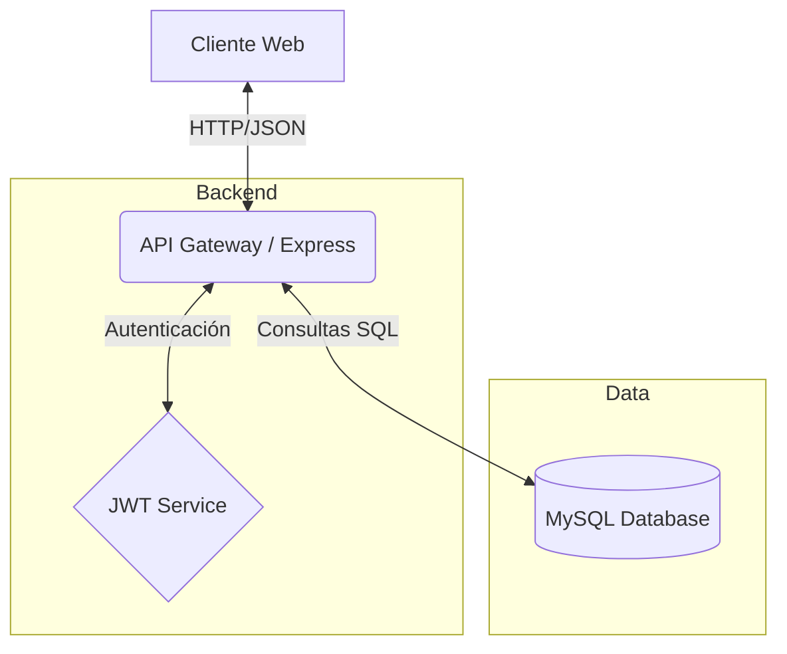

# 📦 Inventario TI & Soporte LDS

> **Gestión Inteligente de Activos** — Sistema integral para el control de inventario tecnológico, asignaciones y mantenimientos de soporte técnico.

<!-- BADGES: Usa style=flat-square -->
[](https://developer.mozilla.org/es/docs/Web/JavaScript)
[](https://nodejs.org/)
[](https://expressjs.com/)
[](https://www.mysql.com/)
[](LICENSE)

<p align="center">
  
</p>

---

## ✨ Características

| Característica           | Descripción                                                         |
| :----------------------- | :------------------------------------------------------------------ |
| 💻 **Gestión de Activos** | Control detallado de equipos, periféricos y direcciones IP.         |
| 👥 **Asignaciones**       | Vinculación de activos a empleados con historial de movimientos.    |
| 🔧 **Mantenimientos**     | Registro y seguimiento de mantenimientos preventivos y correctivos. |
| 🔐 **Seguridad JWT**      | Autenticación robusta basada en tokens para protección de API.      |
| 🏢 **Multisucursal**      | Soporte para múltiples empresas, sucursales y áreas.                |
| 📊 **Dashboard**          | Visualización de estado del sistema y recursos.                     |

---

## 🚀 Inicio Rápido

### Requisitos
- Node.js v18+
- MySQL Server
- NPM o Yarn

### 1. Clonar el repositorio
```bash
git clone https://github.com/herwingxtech/inventario_soporte.git
cd inventario-ti-lds
```

### 2. Configurar variables de entorno

Crea un archivo `.env` en la raíz del proyecto basado en las variables requeridas:

```bash
cp .env.example .env
```

Variables principales:

```env
PORT=3000
NODE_ENV=development
APP_URL=http://localhost:3000/soporte
API_URL=http://localhost:3000/soporte/api

# Base de Datos
DB_HOST=localhost
DB_USER=root
DB_PASSWORD=secret
DB_NAME=inventario_soporte
DB_PORT=3306

# Seguridad
JWT_SECRET=tu_secreto_super_seguro
JWT_EXPIRE=24h
```

> 📘 **Tip:** Para generar un `JWT_SECRET` seguro, ejecuta:
> ```bash
> node -e "console.log(require('crypto').randomBytes(64).toString('hex'))"
> ```

### 3. Instalar dependencias

```bash
npm install
```

### 4. Iniciar la aplicación

```bash
# Modo desarrollo
npm run dev

# Modo producción
npm start
```

---

## 🏗️ Arquitectura



## 📦 Opciones de Despliegue

| Método     | Archivo               | Ideal para                                |
| :--------- | :-------------------- | :---------------------------------------- |
| **Local**  | `npm script`          | Desarrollo y Pruebas rapido               |
| **Docker** | `Dockerfile`          | Despliegue en contenedores (Próximamente) |
| **PM2**    | `ecosystem.config.js` | Producción en servidor Linux              |

## 🗄️ Gestión de Base de Datos

Comandos útiles para respaldar y restaurar la información.

```bash
# Crear Backup
mysqldump -h LOGIN_HOST -u usuario -p inventario_soporte > backup_$(date +%Y%m%d).sql

# Restaurar Backup
mysql -h LOGIN_HOST -u usuario -p inventario_soporte < backup.sql
```

## 🔧 Comandos Útiles

```bash
npm run dev      # Iniciar servidor con nodemon
npm start        # Iniciar servidor en producción
npm test         # Ejecutar pruebas (Pendiente)
```

## 🌐 Endpoints de la API

La API base se encuentra en `/api`. Aquí los módulos principales:

| Módulo           | Endpoint Base     | Descripción                  |
| :--------------- | :---------------- | :--------------------------- |
| **Auth**         | `/auth`           | Login y registro de usuarios |
| **Equipos**      | `/equipos`        | CRUD de equipos de cómputo   |
| **Empleados**    | `/empleados`      | Gestión de personal          |
| **Asignaciones** | `/asignaciones`   | Préstamos y devoluciones     |
| **IPs**          | `/direcciones-ip` | Control de direccionamiento  |
| **Soporte**      | `/mantenimientos` | Tickets y mantenimiento      |

## 📚 Documentación Adicional

| Documento                 | Descripción                       |
| :------------------------ | :-------------------------------- |
| [API Routes](src/routes/) | Definición de endpoints de la API |
| [Schemas](src/models/)    | Modelos de datos (si aplica)      |

## 🛠️ Stack Tecnológico

**Frontend**
- HTML5 / CSS3 (Vanilla)
- JavaScript (Vanilla)
- Bootstrap Select

**Backend**
- Node.js
- Express.js
- JSON Web Tokens (JWT)
- MySQL2

## � Despliegue en Linux (Producción)

Guía para desplegar la aplicación en un servidor Ubuntu/Debian usando PM2 y Nginx.

### 1. Preparación del Entorno
Asegúrate de tener instalado Git, Node.js, MySQL y Nginx:

```bash
sudo apt update && sudo apt upgrade -y
sudo apt install git nodejs npm mysql-server nginx -y
```

### 2. Instalación y Build
Sigue los pasos de "Inicio Rápido" para clonar e instalar dependencias. Luego:

```bash
# Instalar PM2 globalmente
sudo npm install -g pm2
```

### 3. Ejecución con PM2
PM2 mantendrá la aplicación activa 24/7.

```bash
# Iniciar aplicación
pm2 start server.js --name "inventario-lds"

# Guardar lista de procesos para reinicios
pm2 save
pm2 startup
```

### 4. Configuración Nginx (Reverse Proxy)
Configura Nginx para servir la app en el puerto 80/443.

Edita la configuración: `sudo nano /etc/nginx/sites-available/inventario`

```nginx
server {
    listen 80;
    server_name inventario.tu-dominio.com;

    location / {
        proxy_pass http://localhost:3000;
        proxy_http_version 1.1;
        proxy_set_header Upgrade $http_upgrade;
        proxy_set_header Connection 'upgrade';
        proxy_set_header Host $host;
        proxy_cache_bypass $http_upgrade;
    }
}
```

Activa el sitio y reinicia Nginx:
```bash
sudo ln -s /etc/nginx/sites-available/inventario /etc/nginx/sites-enabled/
sudo nginx -t
sudo systemctl restart nginx
```

---

## �🛠️ Solución de Problemas

### Error de conexión a la base de datos
1. Verifica que MySQL esté corriendo.
2. Confirma las credenciales en `.env`.
3. Asegúrate que la base de datos `inventario_soporte` exista.

### Error de JWT
Si recibes errores de token, genera un nuevo `JWT_SECRET` y reinicia el servidor.

### Puerto ocupado
Si el puerto 3000 está en uso:
```bash
lsof -i :3000  # Ver proceso
kill -9 PID    # Matar proceso (opcional)
```

## 🔒 Seguridad
- ✅ Autenticación vía JWT
- ✅ Protección de rutas middleware
- ✅ Variables de entorno seguras
- ✅ Sanitización de consultas SQL (MySQL2 Prepared Statements)

## 🤝 Contribuir
1. Fork del repositorio
2. Crear rama: `git checkout -b feat/nueva-feature`
3. Commit: `git commit -m "feat: descripción"`
4. Push: `git push origin feat/nueva-feature`
5. Crear Pull Request

## 📄 Licencia
Este proyecto está bajo la licencia ISC.
