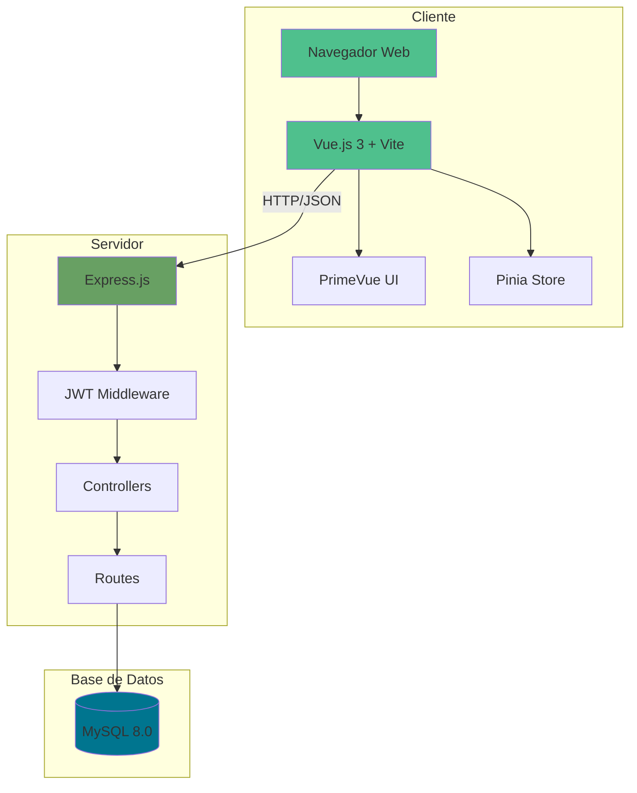
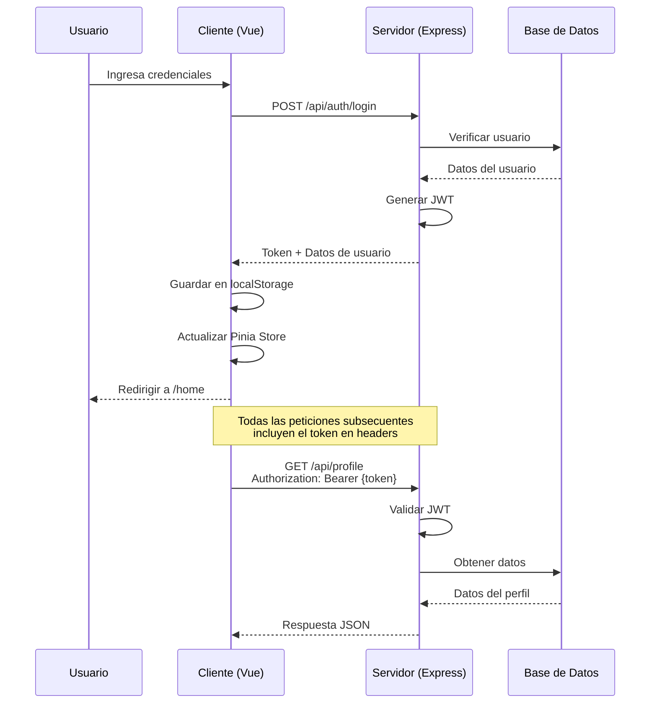
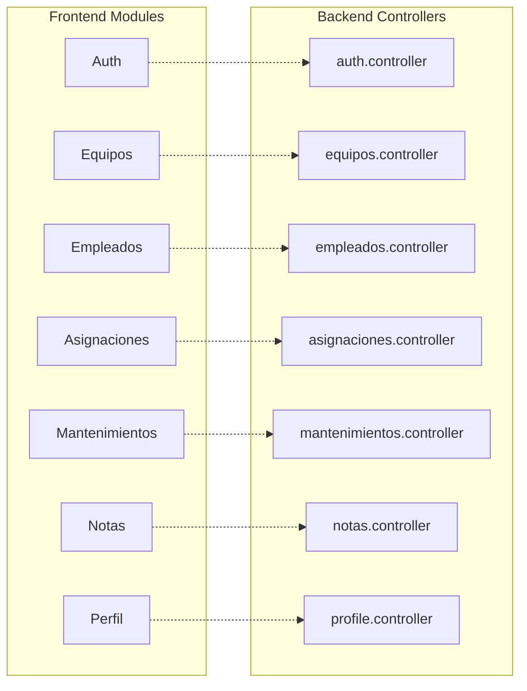

# 🚀 Inventario TI & Soporte LDS

> **Gestión Inteligente de Activos** — Sistema integral para el control de inventario tecnológico, asignaciones y mantenimientos de soporte técnico.

[](https://vuejs.org/)
[](LICENSE)


[](https://developer.mozilla.org/es/docs/Web/JavaScript)
[](https://nodejs.org/)
[](https://vuejs.org/)
[](https://expressjs.com/)
[](https://www.mysql.com/)
[](LICENSE)

---

## ✨ Características

| Característica           | Descripción                                                         |
| :----------------------- | :------------------------------------------------------------------ |
| 💻 **Gestión de Activos** | Control detallado de equipos, periféricos y direcciones IP.         |
| 👥 **Asignaciones**       | Vinculación de activos a empleados con historial de movimientos.    |
| 🔧 **Mantenimientos**     | Registro y seguimiento de mantenimientos preventivos y correctivos. |
| 📝 **Notas y Documentación** | Sistema de notas técnicas y documentación centralizada.          |
| 🔐 **Seguridad JWT**      | Autenticación robusta basada en tokens para protección de API.      |
| 🏢 **Multisucursal**      | Soporte para múltiples empresas, sucursales y áreas.                |
| 🌓 **Modo Oscuro**        | Interfaz adaptable con tema claro y oscuro.                         |
| 📱 **Responsive**         | Diseño adaptativo para escritorio, tablet y móvil.                  |
| 👤 **Perfil de Usuario**  | Gestión de perfil con actualización de email y contraseña.          |

---

## 🏗️ Arquitectura del Sistema

### Arquitectura General



### Flujo de Autenticación



### Estructura de Módulos



---

## 🚀 Inicio Rápido

### Requisitos Previos

- **Node.js** v18 o superior
- **MySQL Server** 8.0 o superior
- **NPM** o **Yarn**

### 1. Clonar el Repositorio

```bash
git clone https://github.com/herwingx/inventario-ti-lds.git
cd inventario-ti-lds
```

### 2. Configurar Backend

```bash
cd server
cp .env.example .env
```

Edita el archivo `.env` con tus credenciales:

```env
PORT=3000
NODE_ENV=development

# Base de Datos
DB_HOST=localhost
DB_USER=root
DB_PASSWORD=tu_password
DB_NAME=inventario_soporte
DB_PORT=3306

# Seguridad
JWT_SECRET=tu_secreto_super_seguro_aqui
```

> 📘 **Generar JWT_SECRET seguro:**
> ```bash
> node -e "console.log(require('crypto').randomBytes(64).toString('hex'))"
> ```

Instalar dependencias:

```bash
npm install
```

### 3. Configurar Frontend

```bash
cd ../client
npm install
```

### 4. Iniciar la Aplicación

**Terminal 1 - Backend:**
```bash
cd server
npm run dev
```

**Terminal 2 - Frontend:**
```bash
cd client
npm run dev
```

La aplicación estará disponible en:
- **Frontend:** http://localhost:5173
- **Backend API:** http://localhost:3000/api

---

## 📁 Estructura del Proyecto

```
inventario-ti-lds/
├── client/                    # Frontend Vue.js
│   ├── src/
│   │   ├── assets/           # Recursos estáticos
│   │   ├── components/       # Componentes reutilizables
│   │   │   ├── dashboard/   # Componentes del dashboard
│   │   │   └── layout/      # Layout (Header, Sidebar)
│   │   ├── layouts/         # Layouts principales
│   │   ├── router/          # Configuración de rutas
│   │   ├── services/        # Servicios de API
│   │   ├── stores/          # Pinia stores
│   │   ├── views/           # Vistas/Páginas
│   │   ├── App.vue
│   │   └── main.js
│   ├── package.json
│   └── vite.config.js
│
├── server/                    # Backend Express
│   ├── src/
│   │   ├── config/          # Configuración (DB, etc)
│   │   ├── controllers/     # Lógica de negocio
│   │   ├── middleware/      # Middlewares (auth, etc)
│   │   └── routes/          # Definición de rutas
│   ├── public/              # Archivos estáticos
│   ├── .env.example
│   ├── package.json
│   └── server.js
│
├── docs/                      # Documentación
├── .gitignore
└── README.md
```

---

## 🌐 Endpoints de la API

### Autenticación

| Método | Endpoint        | Descripción          | Auth |
|:-------|:----------------|:---------------------|:----:|
| POST   | `/api/auth/login` | Iniciar sesión     | ❌   |

### Perfil de Usuario

| Método | Endpoint          | Descripción                | Auth |
|:-------|:------------------|:---------------------------|:----:|
| GET    | `/api/profile`    | Obtener perfil actual      | ✅   |
| PUT    | `/api/profile`    | Actualizar email/password  | ✅   |

### Módulos Principales

| Módulo           | Endpoint Base       | Descripción                  |
|:-----------------|:--------------------|:-----------------------------|
| **Equipos**      | `/api/equipos`      | CRUD de equipos de cómputo   |
| **Empleados**    | `/api/empleados`    | Gestión de personal          |
| **Asignaciones** | `/api/asignaciones` | Préstamos y devoluciones     |
| **IPs**          | `/api/direcciones-ip` | Control de direccionamiento |
| **Mantenimientos** | `/api/mantenimientos` | Tickets y mantenimiento   |
| **Notas**        | `/api/notas`        | Notas técnicas               |
| **Empresas**     | `/api/empresas`     | Gestión de empresas          |
| **Áreas**        | `/api/areas`        | Gestión de áreas             |
| **Sucursales**   | `/api/sucursales`   | Gestión de sucursales        |

> 📘 Todas las rutas (excepto `/api/auth/login`) requieren autenticación JWT.

---

## 🛠️ Stack Tecnológico

### Frontend

| Tecnología | Versión | Propósito |
|:-----------|:--------|:----------|
| Vue.js     | 3.5     | Framework principal |
| Vite       | 6.0     | Build tool y dev server |
| Vue Router | 4.5     | Enrutamiento SPA |
| Pinia      | 2.3     | State management |
| PrimeVue   | 4.2     | Librería de componentes UI |
| Axios      | 1.7     | Cliente HTTP |

### Backend

| Tecnología | Versión | Propósito |
|:-----------|:--------|:----------|
| Node.js    | 18+     | Runtime de JavaScript |
| Express.js | 5.1     | Framework web |
| MySQL2     | 3.14    | Driver de MySQL |
| JWT        | 9.0     | Autenticación |
| bcrypt     | 6.0     | Hash de contraseñas |
| CORS       | 2.8     | Cross-Origin Resource Sharing |

---

## 🔧 Comandos Útiles

### Backend

```bash
npm run dev      # Iniciar con nodemon (desarrollo)
npm start        # Iniciar en producción
```

### Frontend

```bash
npm run dev      # Servidor de desarrollo
npm run build    # Build para producción
npm run preview  # Preview del build
```

---

## 🔒 Seguridad

- ✅ Autenticación JWT con tokens de 30 días
- ✅ Middleware de protección de rutas
- ✅ Hash de contraseñas con bcrypt (10 rounds)
- ✅ Prepared statements para prevenir SQL injection
- ✅ Variables de entorno para credenciales sensibles
- ✅ CORS configurado para origen específico
- ✅ Validación de contraseña actual antes de cambios

---

## 📚 Documentación Adicional

| Documento | Descripción |
|:----------|:------------|
| [Backend README](server/README.md) | Documentación detallada del backend |
| [Frontend README](client/README.md) | Documentación detallada del frontend |
| [Reglas de Negocio](docs/REGLAS_NEGOCIO.md) | Ciclo de vida de activos y reglas lógicas |
| [Plan de Red](docs/PLAN_SEGMENTACION_RED.md) | Estructura de red corporativa /20 |
| [Stack Tecnológico](docs/ARQUITECTURA_TECNOLOGIA.md) | **¿Por qué Vue? ¿Por qué MySQL?** Explicación de arquitectura. |

### 📚 Documentación de Mantenimiento y Desarrollo
Guías esenciales para la continuidad del proyecto:

*   [🛠️ Guía de Desarrollo](docs/GUIA_DESARROLLO.md) - **"Receta de Cocina"** para crear nuevos módulos.
*   [📘 Manual Técnico](docs/MANUAL_TECNICO.md) - Backups, restauración y solución de problemas.
*   [🗂️ Diccionario de Datos](docs/DICCIONARIO_DATOS.md) - Referencia de IDs, roles y estados.


### Estándar de Documentación
El proyecto sigue estrictamente el estándar **JSDoc/DocBlock** para garantizar la mantenibilidad:
- **Backend:** Rutas, Controladores y Middleware documentados con `@module` y Typedefs.
- **Frontend:** Vistas, Componentes y Servicios documentados con `@fileoverview` y prop/method docs.


---

## 🤝 Contribuir

1. Fork del repositorio
2. Crear rama: `git checkout -b feat/nueva-feature`
3. Commit: `git commit -m "feat(modulo): descripción"`
4. Push: `git push origin feat/nueva-feature`
5. Crear Pull Request

### Convenciones de Commits

Seguimos [Conventional Commits](https://www.conventionalcommits.org/):

```
feat(scope): descripción corta
fix(scope): descripción del fix
docs(scope): cambios en documentación
style(scope): formato, sin cambios de lógica
refactor(scope): refactorización de código
test(scope): añadir o corregir tests
chore(scope): tareas de mantenimiento
```

---

## 📄 Licencia

Este proyecto está bajo la licencia ISC.

---

## 👨‍💻 Autor

Desarrollado con ❤️ por [herwingx](https://github.com/herwingx)
