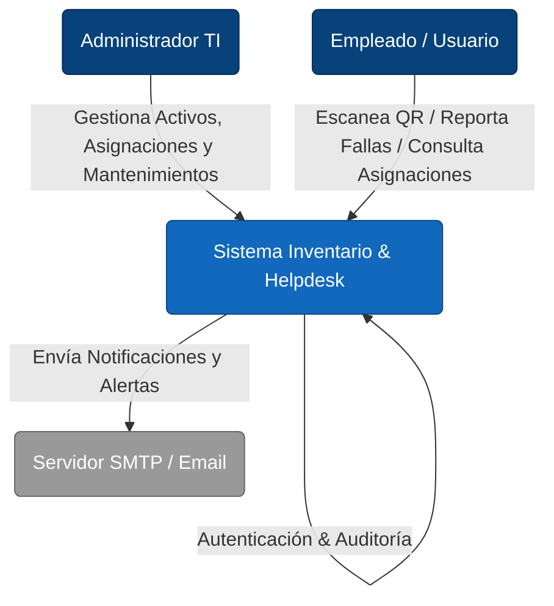

# 🏢 Sistema de Gestión de Activos TI & Helpdesk

> **Enterprise Resource Planning (ERP) para Departamentos de TI**
>
> Gestión centralizada del ciclo de vida de activos tecnológicos, asignaciones a empleados, control de red y soporte técnico mediante flujos QR.

[](https://github.com/herwingx/inventario-ti-lds/graphs/commit-activity)
[](docs/ARQUITECTURA_TECNOLOGIA.md)
[](docs/)

---

## 🏗️ Arquitectura de Alto Nivel (C4 Context)

El sistema actúa como el núcleo de verdad para el departamento de TI, interactuando con empleados internos y usuarios externos para reportes de fallas.



---

## ⚡ Quick Start (Onboarding)

Diseñado para iniciar el entorno de desarrollo en menos de 5 minutos.

### Prerrequisitos
*   **Node.js** v18+ (LTS)
*   **MySQL** 8.0+
*   **Git**

### Instalación Automática
Hemos creado un script de orquestación en la raíz del proyecto:

```bash
# 1. Clonar repositorio
git clone https://github.com/herwingx/inventario-ti-lds.git
cd inventario-ti-lds

# 2. Configuración de Variables de Entorno
cp server/.env.example server/.env
# IMPORTANTE: Edita server/.env con tus credenciales de MySQL (DB_USER, DB_PASSWORD)

# 3. Instalación de Dependencias y Generación de Clientes (Backend & Frontend)
npm run setup
```

### Ejecución
Para desarrollo, recomendamos abrir dos terminales:

**Terminal 1 (Backend API):**
```bash
npm run dev:server
# API disponible en http://localhost:3000
```

**Terminal 2 (Frontend SPA):**
```bash
npm run dev:client
# UI disponible en http://localhost:5173
```

---

## 🧩 Módulos del Sistema

| Módulo | Descripción Técnica |
| :--- | :--- |
| **📦 Inventario Core** | CRUD transaccional de hardware (`Equipos`, `Periféricos`) con validación de unicidad (Serie, MAC). |
| **🔗 Asignaciones** | Lógica de negocio para préstamos con trazabilidad histórica (Quién tuvo qué y cuándo). |
| **🌐 Control IP** | Gestión de direcciones IP (`Redes`) para evitar conflictos en la LAN corporativa. |
| **🎫 Helpdesk QR** | Sistema público/privado para reporte de incidentes mediante escaneo de tokens QR únicos. |
| **🔧 Mantenimientos** | Registro de intervenciones técnicas, costos y evidencias (archivos adjuntos). |
| **👮 Auth & Audit** | JWT (Stateless) para autenticación y Logs de Auditoría para trazabilidad forense. |

---

## 📚 Documentación de Ingeniería

Para una comprensión profunda de las decisiones técnicas:

*   [🏛️ Arquitectura & Stack](docs/ARQUITECTURA_TECNOLOGIA.md) - Diagramas C4 Container y justificación tecnológica.
*   [⚖️ ADRs (Decision Records)](docs/ADR/) - Registro de decisiones arquitectónicas clave (ej. Prisma vs Raw SQL).
*   [📘 Manual Técnico](docs/MANUAL_TECNICO.md) - Guías de despliegue, backups y troubleshooting.
*   [🗃️ Diccionario de Datos](docs/DICCIONARIO_DATOS.md) - Esquema de base de datos y enumeraciones.

---

## 🤝 Contribución

Este proyecto sigue el estándar **Conventional Commits** para el historial de cambios.

```bash
git commit -m "feat(auth): implementar refresh token rotativo"
git commit -m "fix(equipos): corregir validación de numero de serie duplicado"
```

Consulte el [CHANGELOG.md](CHANGELOG.md) para ver el historial de versiones.

---

**© 2026 Departamento de TI** - Desarrollado bajo estándares ISO/IEC 25010 de Calidad de Software.