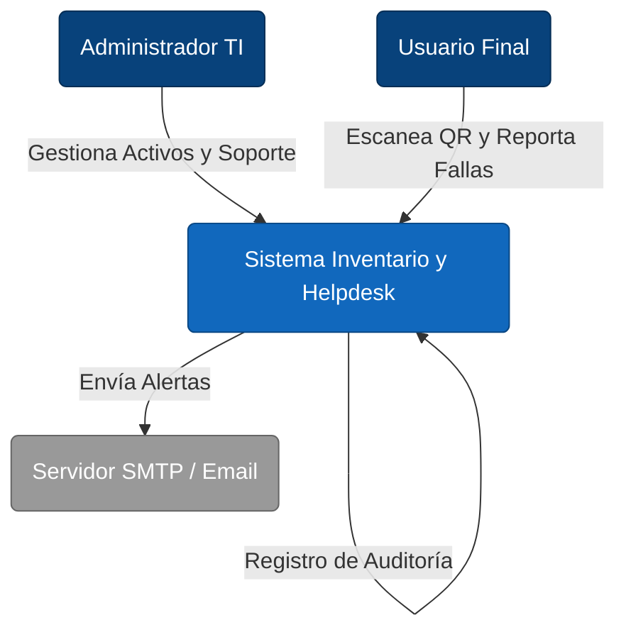

# 🏢 Sistema de Gestión de Activos TI & Helpdesk

> **Enterprise Resource Planning (ERP) para Departamentos de TI**
>
> Gestión centralizada del ciclo de vida de activos tecnológicos, asignaciones a empleados, control de red y soporte técnico mediante flujos QR.

[](https://github.com/herwingx/inventario-ti-lds/graphs/commit-activity)
[](docs/ARQUITECTURA_TECNOLOGIA.md)
[](docs/)
[](http://localhost:3000/api-docs)

---

## 🏗️ Arquitectura de Alto Nivel (C4 Context)

El sistema actúa como el núcleo de verdad para el departamento de TI, interactuando con empleados internos y usuarios externos para reportes de fallas.



---

## 🚀 Quick Start (Enterprise Onboarding)

Sigue estos pasos para levantar el entorno de desarrollo local (Localhost) en menos de 5 minutos.

### 0. Prerrequisitos
* **Node.js**: `v18.x` o superior (`node -v`)
* **MySQL**: `v8.0` corriendo en puerto `3306`.
* **Git Bash** (Windows) o Terminal (Linux/Mac).

### 1. Configuración del Entorno (Bootstrap)
Ejecuta los siguientes comandos para instalar dependencias y configurar variables de entorno:

```bash
# 1. Clonar repositorio
git clone https://github.com/herwingx/inventario-ti-lds.git
cd inventario-ti-lds

# 2. Configuración Backend
cd server
npm install
cp .env.example .env
# ⚠️ ADVERTENCIA: Edita server/.env y configura tu DB_PASSWORD y JWT_SECRET antes de continuar.

# 3. Base de Datos (Migraciones y Seeds)
npx prisma migrate dev --name init
npm run seed # Carga usuario admin por defecto (admin / 123456)

# 4. Configuración Frontend
cd ../client
npm install
```

### 2. Ejecución (Developer Mode)
Recomendamos usar dos terminales separadas para ver los logs en tiempo real:

**Terminal A (API Server):**
```bash
cd server
npm run dev
# 🟢 API Check: http://localhost:3000/api/status
# 📄 Docs: http://localhost:3000/api-docs
```

**Terminal B (Frontend):**
```bash
cd client
npm run dev
# 🖥️ UI: http://localhost:5173
```

---

## 🌐 Ejecución en un solo puerto (3000)

Para servir frontend y backend desde el mismo puerto (3000):

```bash
cd /ruta/inventario-ti-lds
npm run build:prod
npm run start:3000
```

Notas de operación:
* El build de Vite se genera en `client/dist`.
* El backend publica `client/dist` automáticamente cuando existe.
* URL principal en LAN: `http://IP:3000/soporte/`.

Con PM2:

```bash
pm2 start npm --name "inventario-3000" -- run start:3000
pm2 logs inventario-3000
```

Si colocas Nginx/Apache por delante, puedes ocultar `:3000` y exponer la app en 80/443.

---

## 🧩 Módulos del Sistema

| Módulo | Descripción Técnica |
| :--- | :--- |
| **📦 Inventario Core** | CRUD transaccional de hardware (`Equipos`) con validación de unicidad (Serie, MAC). |
| **🔗 Asignaciones** | Lógica de negocio para préstamos con trazabilidad histórica (Quién tuvo qué y cuándo). |
| **🌐 Control IP** | Gestión de direcciones IP (`Redes`) para evitar conflictos en la LAN corporativa. |
| **🎫 Helpdesk QR** | Sistema público/privado para reporte de incidentes mediante escaneo de tokens QR únicos. |
| **🔧 Mantenimientos** | Registro de intervenciones técnicas, costos y evidencias (archivos adjuntos). |
| **👮 Auth & Audit** | JWT (Stateless) para autenticación y Logs de Auditoría para trazabilidad forense. |

---

## 📚 Documentación de Ingeniería

Para una comprensión profunda de las decisiones técnicas:

*   [🏛️ Arquitectura & Stack](docs/ARQUITECTURA_TECNOLOGIA.md) - Diagramas C4 Container y justificación tecnológica.
*   [⚖️ ADRs (Decision Records)](docs/ADR/) - Registro de decisiones arquitectónicas clave (ej. Soft Delete).
*   [📘 Manual Técnico](docs/MANUAL_TECNICO.md) - Guías de despliegue, backups y troubleshooting.
*   [🗂️ Diccionario de Datos](docs/DICCIONARIO_DATOS.md) - Esquema de base de datos y enumeraciones.
*   [📘 Manual de Funcionamiento](docs/MANUAL_FUNCIONAMIENTO.md) - Lógica interna y flujos de datos detallados.
*   [🎫 Manual de Acceso y Tickets](docs/MANUAL_ACCESO_Y_TICKETS.md) - Flujo actualizado de registro, login y soporte general TI.

---

## 🤝 Contribución

Este proyecto sigue el estándar **Conventional Commits** para el historial de cambios.

```bash
git commit -m "feat(auth): implementar refresh token rotativo"
git commit -m "fix(equipos): corregir validación de numero de serie duplicado"
```

Consulte el [CHANGELOG.md](CHANGELOG.md) para ver el historial de versiones.

---

**© 2026 Departamento de TI** - Desarrollado bajo estándares ISO/IEC 25010 de Calidad de Software.
