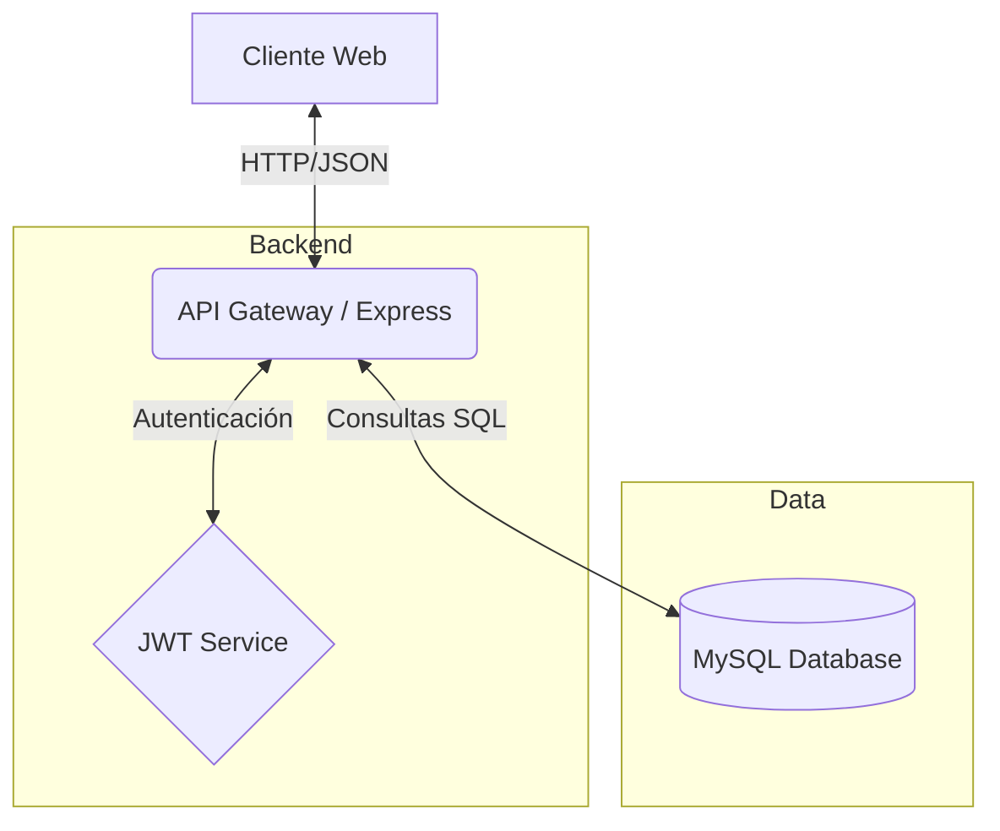

#  Inventario TI & Soporte LDS

> **Gestión Inteligente de Activos** — Sistema integral para el control de inventario tecnológico, asignaciones y mantenimientos de soporte técnico.

<!-- BADGES: Usa style=flat-square -->
[](https://developer.mozilla.org/es/docs/Web/JavaScript)
[](https://nodejs.org/)
[](https://expressjs.com/)
[](https://www.mysql.com/)
[](LICENSE)

<p align="center">
  
</p>

---

## ✨ Características

| Característica           | Descripción                                                         |
| :----------------------- | :------------------------------------------------------------------ |
| 💻 **Gestión de Activos** | Control detallado de equipos, periféricos y direcciones IP.         |
| 👥 **Asignaciones**       | Vinculación de activos a empleados con historial de movimientos.    |
| 🔧 **Mantenimientos**     | Registro y seguimiento de mantenimientos preventivos y correctivos. |
| 🔐 **Seguridad JWT**      | Autenticación robusta basada en tokens para protección de API.      |
| 🏢 **Multisucursal**      | Soporte para múltiples empresas, sucursales y áreas.                |
| 📊 **Dashboard**          | Visualización de estado del sistema y recursos.                     |

---

## 🚀 Inicio Rápido

### Requisitos
- Node.js v18+
- MySQL Server
- NPM o Yarn

### 1. Clonar el repositorio
```bash
git clone https://github.com/herwingxtech/inventario_soporte.git
cd inventario-ti-lds
```

### 2. Configurar variables de entorno

Crea un archivo `.env` en la raíz del proyecto basado en las variables requeridas:

```env
PORT=3000
NODE_ENV=development
APP_URL=http://localhost:3000/soporte
API_URL=http://localhost:3000/soporte/api

# Base de Datos
DB_HOST=localhost
DB_USER=root
DB_PASSWORD=secret
DB_NAME=inventario_soporte
DB_PORT=3306

# Seguridad
JWT_SECRET=tu_secreto_super_seguro
JWT_EXPIRE=24h
```

### 3. Instalar dependencias

```bash
npm install
```

### 4. Iniciar la aplicación

```bash
# Modo desarrollo
npm run dev

# Modo producción
npm start
```

---

## 🏗️ Arquitectura



## 📦 Opciones de Despliegue

| Método     | Archivo               | Ideal para                                |
| :--------- | :-------------------- | :---------------------------------------- |
| **Local**  | `npm script`          | Desarrollo y Pruebas rapido               |
| **Docker** | `Dockerfile`          | Despliegue en contenedores (Próximamente) |
| **PM2**    | `ecosystem.config.js` | Producción en servidor Linux              |

## 🔧 Comandos Útiles

```bash
npm run dev      # Iniciar servidor con nodemon
npm start        # Iniciar servidor en producción
npm test         # Ejecutar pruebas (Pendiente)
```

## 📚 Documentación

| Documento                 | Descripción                       |
| :------------------------ | :-------------------------------- |
| [API Routes](src/routes/) | Definición de endpoints de la API |
| [Schemas](src/models/)    | Modelos de datos (si aplica)      |

## 🛠️ Stack Tecnológico

**Frontend**
- HTML5 / CSS3 (Vanilla)
- JavaScript (Vanilla)
- Bootstrap Select

**Backend**
- Node.js
- Express.js
- JSON Web Tokens (JWT)
- MySQL2

## 🔒 Seguridad
- ✅ Autenticación vía JWT
- ✅ Protección de rutas middleware
- ✅ Variables de entorno seguras
- ✅ Sanitización de consultas SQL (MySQL2 Prepared Statements)

## 🤝 Contribuir
1. Fork del repositorio
2. Crear rama: `git checkout -b feat/nueva-feature`
3. Commit: `git commit -m "feat: descripción"`
4. Push: `git push origin feat/nueva-feature`
5. Crear Pull Request

## 📄 Licencia
Este proyecto está bajo la licencia ISC.
