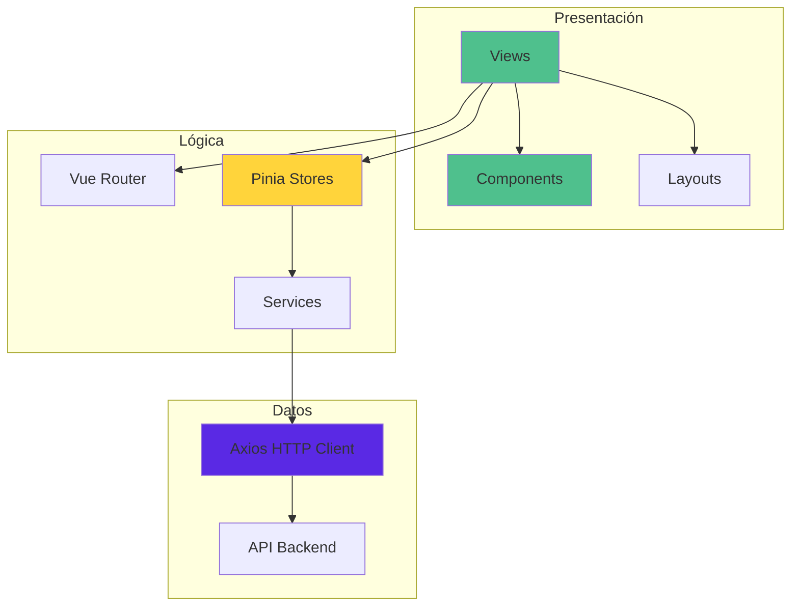
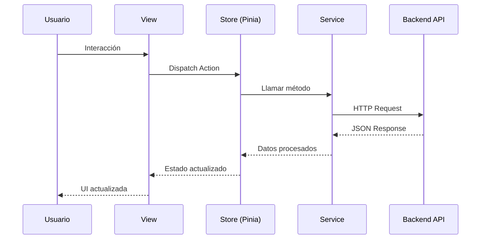

# 🎨 Frontend - Inventario TI & Soporte LDS

> Aplicación web moderna construida con Vue.js 3, Vite y PrimeVue para la gestión de inventario tecnológico.

---

## 📋 Tabla de Contenidos

- [Arquitectura](#-arquitectura)
- [Instalación](#-instalación)
- [Estructura del Proyecto](#-estructura-del-proyecto)
- [Componentes Principales](#-componentes-principales)
- [Routing](#-routing)
- [State Management](#-state-management)
- [Estilos y Temas](#-estilos-y-temas)
- [Build y Despliegue](#-build-y-despliegue)

---

## 🏗️ Arquitectura



### Flujo de Datos



---

## 🚀 Instalación

### Requisitos

- Node.js v18 o superior
- NPM o Yarn

### Pasos

1. **Navegar al directorio del cliente:**
   ```bash
   cd client
   ```

2. **Instalar dependencias:**
   ```bash
   npm install
   ```

3. **Configurar variables de entorno (opcional):**
   
   Crear archivo `.env.local`:
   ```env
   VITE_API_URL=http://localhost:3000/api
   ```

4. **Iniciar servidor de desarrollo:**
   ```bash
   npm run dev
   ```

   La aplicación estará disponible en `http://localhost:5173`

---

## 📁 Estructura del Proyecto

```
client/
├── public/                       # Archivos estáticos
│
├── src/
│   ├── assets/                   # Recursos (CSS, imágenes)
│   │   └── main.css             # Estilos globales
│   │
│   ├── components/               # Componentes reutilizables
│   │   ├── dashboard/           # Componentes del dashboard
│   │   │   ├── StatsCard.vue
│   │   │   ├── RecentActivity.vue
│   │   │   └── QuickActions.vue
│   │   └── layout/              # Componentes de layout
│   │       ├── TheHeader.vue
│   │       └── TheSidebar.vue
│   │
│   ├── layouts/                  # Layouts principales
│   │   └── MainLayout.vue       # Layout con sidebar y header
│   │
│   ├── router/                   # Configuración de rutas
│   │   └── index.js
│   │
│   ├── services/                 # Servicios de API
│   │   ├── api.js               # Configuración de Axios
│   │   ├── AuthService.js
│   │   ├── ProfileService.js
│   │   ├── EquiposService.js
│   │   ├── EmpleadosService.js
│   │   ├── AsignacionesService.js
│   │   ├── MantenimientosService.js
│   │   ├── NotasService.js
│   │   ├── DireccionesIpService.js
│   │   ├── CorreosService.js
│   │   ├── EmpresasService.js
│   │   ├── AreasService.js
│   │   ├── SucursalesService.js
│   │   ├── CatalogosService.js
│   │   └── DashboardService.js
│   │
│   ├── stores/                   # Pinia stores
│   │   ├── auth.js              # Estado de autenticación
│   │   └── theme.js             # Estado del tema (dark/light)
│   │
│   ├── views/                    # Vistas/Páginas
│   │   ├── LoginView.vue
│   │   ├── HomeView.vue
│   │   ├── ProfileView.vue
│   │   ├── EquiposView.vue
│   │   ├── EquiposFormView.vue
│   │   ├── EquiposDetailView.vue
│   │   ├── EmpleadosView.vue
│   │   ├── EmpleadosFormView.vue
│   │   ├── EmpleadosDetailView.vue
│   │   ├── AsignacionesView.vue
│   │   ├── AsignacionesFormView.vue
│   │   ├── AsignacionesDetailView.vue
│   │   ├── MantenimientosView.vue
│   │   ├── MantenimientosFormView.vue
│   │   ├── NotasView.vue
│   │   ├── NotasFormView.vue
│   │   ├── DireccionesIpView.vue
│   │   ├── DireccionesIpFormView.vue
│   │   ├── DireccionesIpDetailView.vue
│   │   ├── CorreosView.vue
│   │   ├── CorreosFormView.vue
│   │   ├── CorreosDetailView.vue
│   │   ├── EmpresasView.vue
│   │   ├── EmpresasFormView.vue
│   │   ├── AreasView.vue
│   │   ├── AreasFormView.vue
│   │   ├── AreasDetailView.vue
│   │   ├── SucursalesView.vue
│   │   ├── SucursalesFormView.vue
│   │   └── SucursalesDetailView.vue
│   │
│   ├── App.vue                   # Componente raíz
│   └── main.js                   # Punto de entrada
│
├── .gitignore
├── index.html
├── package.json
├── README.md
└── vite.config.js               # Configuración de Vite
```

---

## 🧩 Componentes Principales

### Layout Components

#### TheHeader.vue
- Barra superior con título de página
- Botón de toggle del sidebar (móvil)
- Selector de tema (claro/oscuro)
- Dropdown de usuario con perfil y logout

#### TheSidebar.vue
- Navegación principal con acordeón
- Responsive (colapsable en desktop, overlay en móvil)
- Iconos de PrimeIcons
- Indicador de ruta activa

#### MainLayout.vue
- Layout principal que combina Header y Sidebar
- Manejo de estado de sidebar (collapsed/open)
- Detección de viewport móvil
- Overlay para cerrar sidebar en móvil

### Dashboard Components

#### StatsCard.vue
```vue
<StatsCard
  title="Total Equipos"
  :value="150"
  icon="pi-desktop"
  trend="up"
  :trendValue="12"
/>
```

#### RecentActivity.vue
- Lista de actividades recientes
- Formato de fecha relativa
- Iconos según tipo de actividad

#### QuickActions.vue
- Accesos rápidos a acciones comunes
- Botones con iconos y tooltips

---

## 🛣️ Routing

### Configuración de Rutas

```javascript
// router/index.js
const routes = [
  {
    path: '/',
    component: MainLayout,
    children: [
      { path: '', redirect: '/home' },
      { path: 'home', name: 'home', component: HomeView },
      { path: 'perfil', name: 'perfil', component: ProfileView },
      // ... más rutas
    ]
  },
  {
    path: '/login',
    name: 'login',
    component: LoginView
  }
]
```

### Guards de Navegación

```javascript
router.beforeEach((to, from, next) => {
  const publicPages = ['/login']
  const authRequired = !publicPages.includes(to.path)
  const token = localStorage.getItem('token')

  if (authRequired && !token) {
    return next('/login')
  }

  if (to.path === '/login' && token) {
    return next('/home')
  }

  next()
})
```

### Estructura de Rutas

```mermaid
graph LR
    A[/] --> B[MainLayout]
    B --> C[/home]
    B --> D[/perfil]
    B --> E[/equipos]
    B --> F[/empleados]
    B --> G[/asignaciones]
    B --> H[/mantenimientos]
    B --> I[/notas]
    
    A --> J[/login]
    
    E --> K[/equipos/nuevo]
    E --> L[/equipos/:id]
    E --> M[/equipos/editar/:id]
```

---

## 🗃️ State Management

### Auth Store

```javascript
// stores/auth.js
export const useAuthStore = defineStore('auth', () => {
  const token = ref(localStorage.getItem('token') || null)
  const user = ref(JSON.parse(localStorage.getItem('userData')) || null)
  
  const isAuthenticated = computed(() => !!token.value)
  const username = computed(() => user.value?.username || 'Usuario')
  const userInitial = computed(() => 
    user.value?.username?.charAt(0).toUpperCase() || 'U'
  )
  
  async function login(username, password) {
    const response = await AuthService.login({ username, password })
    token.value = response.token
    user.value = response.user
    localStorage.setItem('token', response.token)
    localStorage.setItem('userData', JSON.stringify(response.user))
    router.push('/home')
  }
  
  function logout() {
    token.value = null
    user.value = null
    localStorage.removeItem('token')
    localStorage.removeItem('userData')
    router.push('/login')
  }
  
  return { token, user, isAuthenticated, username, userInitial, login, logout }
})
```

### Theme Store

```javascript
// stores/theme.js
export const useThemeStore = defineStore('theme', () => {
  const isDark = ref(localStorage.getItem('theme') === 'dark')
  
  function toggleTheme() {
    isDark.value = !isDark.value
    localStorage.setItem('theme', isDark.value ? 'dark' : 'light')
    document.documentElement.classList.toggle('dark', isDark.value)
  }
  
  return { isDark, toggleTheme }
})
```

---

## 🎨 Estilos y Temas

### Sistema de Colores

```css
/* Modo Claro */
:root {
  --primary: #3B82F6;
  --primary-hover: #2563EB;
  --light-bg: #F9FAFB;
  --light-card: #FFFFFF;
  --light-text: #111827;
  --light-muted: #6B7280;
  --light-border: #E5E7EB;
}

/* Modo Oscuro */
.dark {
  --dark-bg: #111827;
  --dark-card: #1F2937;
  --dark-text: #F9FAFB;
  --dark-muted: #9CA3AF;
  --dark-border: #374151;
}
```

### Componentes PrimeVue

Se utiliza **PrimeVue 4** con personalización mediante `pt` (passthrough):

```vue
<Button 
  label="Guardar"
  class="!bg-primary !border-none hover:!bg-primary-hover"
/>

<InputText 
  v-model="form.email"
  class="!bg-gray-50 dark:!bg-dark-bg"
/>
```

### Animaciones

```css
.animate-fade-in-up {
  animation: fadeInUp 0.4s ease-out forwards;
}

@keyframes fadeInUp {
  from {
    opacity: 0;
    transform: translateY(15px);
  }
  to {
    opacity: 1;
    transform: translateY(0);
  }
}
```

---

## 🔌 Servicios de API

### Configuración de Axios

```javascript
// services/api.js
import axios from 'axios'

const api = axios.create({
  baseURL: import.meta.env.VITE_API_URL || 'http://localhost:3000/api',
  headers: {
    'Content-Type': 'application/json'
  }
})

// Interceptor para agregar token
api.interceptors.request.use(config => {
  const token = localStorage.getItem('token')
  if (token) {
    config.headers.Authorization = `Bearer ${token}`
  }
  return config
})

// Interceptor para manejar errores
api.interceptors.response.use(
  response => response,
  error => {
    if (error.response?.status === 401) {
      localStorage.removeItem('token')
      localStorage.removeItem('userData')
      window.location.href = '/login'
    }
    return Promise.reject(error)
  }
)

export default api
```

### Ejemplo de Servicio

```javascript
// services/EquiposService.js
import api from './api'

export default {
  getAll() {
    return api.get('/equipos').then(res => res.data)
  },
  
  getById(id) {
    return api.get(`/equipos/${id}`).then(res => res.data)
  },
  
  create(data) {
    return api.post('/equipos', data).then(res => res.data)
  },
  
  update(id, data) {
    return api.put(`/equipos/${id}`, data).then(res => res.data)
  },
  
  delete(id) {
    return api.delete(`/equipos/${id}`).then(res => res.data)
  }
}
```

---

## 📦 Build y Despliegue

### Build para Producción

```bash
npm run build
```

Esto genera los archivos optimizados en `dist/`:

```
dist/
├── assets/
│   ├── index-[hash].js
│   ├── index-[hash].css
│   └── ...
└── index.html
```

### Preview del Build

```bash
npm run preview
```

### Despliegue con Nginx

```nginx
server {
    listen 80;
    server_name inventario.tudominio.com;
    root /var/www/inventario-ti-lds/client/dist;
    index index.html;

    location / {
        try_files $uri $uri/ /index.html;
    }

    location /api {
        proxy_pass http://localhost:3000;
        proxy_http_version 1.1;
        proxy_set_header Upgrade $http_upgrade;
        proxy_set_header Connection 'upgrade';
        proxy_set_header Host $host;
        proxy_cache_bypass $http_upgrade;
    }
}
```

### Variables de Entorno en Producción

Crear archivo `.env.production`:

```env
VITE_API_URL=https://api.tudominio.com/api
```

---

## 🛠️ Comandos Útiles

```bash
# Desarrollo
npm run dev           # Servidor de desarrollo

# Build
npm run build         # Build para producción
npm run preview       # Preview del build

# Linting (si está configurado)
npm run lint          # Ejecutar linter
npm run lint:fix      # Corregir errores automáticamente
```

---

## 🎯 Mejores Prácticas

### Composables

Crear composables reutilizables para lógica común:

```javascript
// composables/useToast.js
import { useToast } from 'primevue/usetoast'

export function useSuccessToast() {
  const toast = useToast()
  
  return (message) => {
    toast.add({
      severity: 'success',
      summary: 'Éxito',
      detail: message,
      life: 3000
    })
  }
}
```

### Lazy Loading de Rutas

```javascript
{
  path: 'equipos',
  component: () => import('../views/EquiposView.vue')
}
```

### Validación de Formularios

```javascript
const errors = ref({})

const validate = () => {
  errors.value = {}
  if (!form.value.nombre) {
    errors.value.nombre = 'El nombre es obligatorio'
  }
  return Object.keys(errors.value).length === 0
}
```

---

## 🤝 Contribuir

Ver [README principal](../README.md#-contribuir) para guías de contribución.

---

## 📄 Licencia

ISC License - Ver [LICENSE](../LICENSE) para más detalles.
