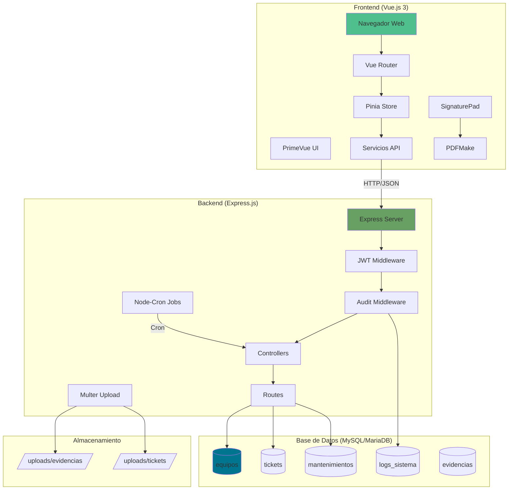
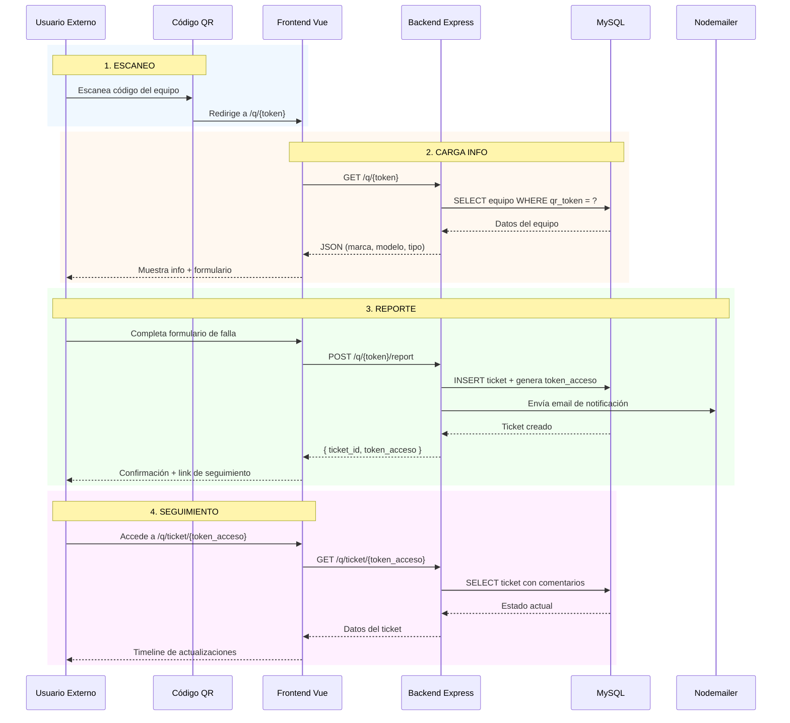
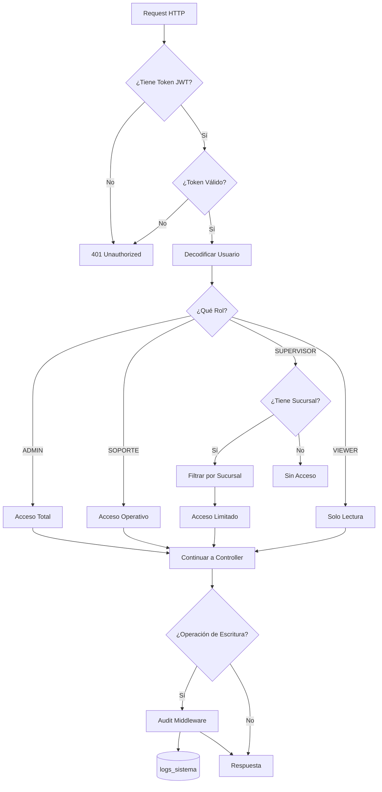
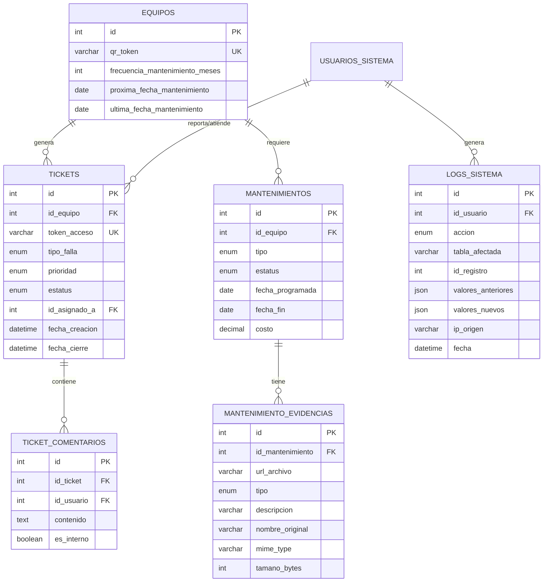

# 🏗️ Arquitectura Fase 2 - Gestión Inteligente de Activos

Este documento describe la arquitectura técnica de la Fase 2 del sistema, que incluye Helpdesk, Mantenimiento Proactivo y Auditoría.

---

## 📊 Diagrama de Arquitectura General



---

## 🔄 Flujo de Tickets QR



---

## 🔐 Flujo de Autenticación y Roles



---

## 📁 Estructura de Archivos Fase 2

```
inventario-ti-lds/
├── client/
│   ├── src/
│   │   ├── components/
│   │   │   └── ui/
│   │   │       └── SignaturePad.vue      # [NUEVO] Captura de firmas
│   │   ├── services/
│   │   │   ├── TicketsService.js         # [NUEVO] API Tickets
│   │   │   ├── QrPublicService.js        # [NUEVO] API QR Público
│   │   │   └── MaintenanceService.js     # [MOD] + Evidencias
│   │   ├── utils/
│   │   │   └── pdfGenerator.js           # [NUEVO] Generación PDFs
│   │   └── views/
│   │       ├── QrLandingView.vue         # [NUEVO] Landing QR
│   │       ├── TicketTrackingView.vue    # [NUEVO] Seguimiento
│   │       ├── TicketsView.vue           # [NUEVO] Listado
│   │       ├── TicketsDetailView.vue     # [NUEVO] Detalle
│   │       └── MantenimientosFormView.vue # [MOD] + Evidencias
│   └── package.json                       # + pdfmake, signature_pad
│
├── server/
│   ├── scripts/
│   │   └── migrations/
│   │       └── 002_mantenimiento_evidencias.sql  # [NUEVO]
│   ├── src/
│   │   ├── config/
│   │   │   ├── cron.config.js            # [NUEVO] Alertas programadas
│   │   │   └── upload.config.js          # [NUEVO] Multer config
│   │   ├── controllers/
│   │   │   ├── tickets.controller.js     # [NUEVO]
│   │   │   ├── qr-public.controller.js   # [NUEVO]
│   │   │   └── mantenimientos.controller.js # [MOD] + Evidencias
│   │   ├── middleware/
│   │   │   ├── audit.middleware.js       # [NUEVO] Logs automáticos
│   │   │   └── auth.middleware.js        # [MOD] + Roles granulares
│   │   ├── routes/
│   │   │   ├── tickets.routes.js         # [NUEVO]
│   │   │   ├── qr-public.routes.js       # [NUEVO]
│   │   │   └── mantenimientos.routes.js  # [MOD] + Evidencias
│   │   └── services/
│   │       └── ticketNotification.service.js # [NUEVO]
│   ├── uploads/
│   │   ├── evidencias/                   # [NUEVO] Fotos mantenimiento
│   │   └── tickets/                      # [NUEVO] Evidencia tickets
│   └── package.json                       # + multer, node-cron, uuid
│
└── docs/
    ├── ARQUITECTURA_FASE2.md             # [NUEVO] Este archivo
    ├── REGLAS_NEGOCIO.md                 # [MOD] + Tickets, QR, Auditoría
    └── DICCIONARIO_DATOS.md              # [MOD] + Estados, Tipos
```

---

## 🗄️ Esquema de Base de Datos Fase 2



---

## 🔧 Componentes Clave

### 1. Middleware de Auditoría (`audit.middleware.js`)

Intercepta automáticamente operaciones POST/PUT/DELETE y registra:
- Usuario que realizó la acción
- Tabla y registro afectado
- Valores antes y después del cambio
- IP de origen y User-Agent

### 2. Sistema de Roles (`auth.middleware.js`)

| Rol | ID | Permisos |
|:----|:--:|:---------|
| ADMIN | 1 | Acceso total sin restricciones |
| VIEWER | 2 | Solo lectura de datos |
| SUPERVISOR | 3 | Filtrado por sucursal asignada |
| SOPORTE | N/A | (Reservado para futuro, no implementado en BD) |

### 3. Cron Jobs (`cron.config.js`)

| Job | Horario | Descripción |
|:----|:--------|:------------|
| Alerta Mantenimiento | 8:00 AM diario | Envía email de equipos con mantenimiento próximo |

### 4. Upload de Archivos (`upload.config.js`)

- **Formatos**: JPG, PNG, WEBP, PDF
- **Tamaño máximo**: 5MB
- **Nombres**: UUID único para evitar colisiones
- **Destino**: `/uploads/{evidencias|tickets}/`

---

## 📝 Notas de Implementación

1. **Tokens QR**: Se generan con UUID v4 y son inmutables una vez creados.
2. **Firmas Digitales**: Se guardan como base64 en el PDF, no en BD.
3. **Evidencias**: Se eliminan físicamente al borrar el mantenimiento (CASCADE).
4. **Auditoría**: No bloquea la operación si falla el registro del log.

---

## ✅ Checklist de Verificación

- [ ] Migración SQL ejecutada
- [ ] Carpetas de uploads creadas
- [ ] Rol SUPERVISOR creado en BD
- [ ] Cron jobs activos
- [ ] Endpoints de evidencias funcionando
- [ ] Formulario de mantenimientos con FileUpload
- [ ] Generación de PDFs operativa
- [ ] Firma digital capturando correctamente
