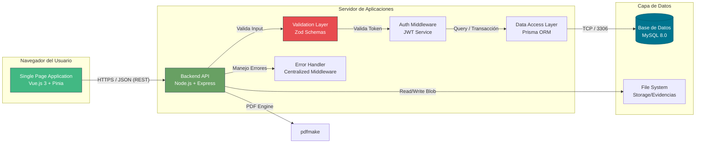
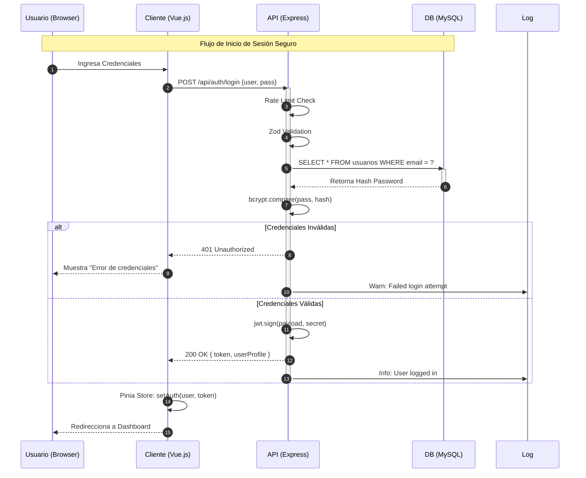

# 🏗️ Arquitectura de Software y Stack Tecnológico

> **Nivel de Abstracción:** Contenedores (C4 Level 2)
>
> Este documento detalla la interacción entre los componentes lógicos del sistema, las tecnologías seleccionadas y los patrones de diseño aplicados.

## 🔭 Visión General (Container Diagram)

El sistema sigue una arquitectura **Monolítica Modular Desacoplada** (Decoupled Monolith). El Frontend (SPA) y el Backend (API) están separados físicamente pero residen en el mismo repositorio (Monorepo) para facilitar el desarrollo.

---

## 🛠️ Stack Tecnológico (MEVN+)

### 1. Frontend: Vue.js 3 (Composition API)
*   **Justificación:** Se eligió Vue 3 por su rendimiento superior y la **Composition API**, que permite reutilizar lógica de negocio (Composables) mejor que React Hooks en escenarios complejos.
*   **UI Framework:** PrimeVue (Tema Aura). Provee componentes empresariales robustos (DataTables, DatePickers) reduciendo el tiempo de desarrollo UI en un 60%.
*   **State Management:** Pinia. Gestiona el estado de sesión (Usuario, Permisos) y caché de catálogos.

### 2. Backend: Node.js + Express (Hardened)
*   **Modelo de Concurrencia:** Non-blocking I/O. Ideal para una aplicación intensiva en I/O.
*   **Validación Estricta:** Implementación de **Zod** en todos los controladores para garantizar la integridad de los datos antes de que lleguen a la capa de servicio.
*   **Manejo de Errores:** Middleware centralizado (`error.middleware.js`) que captura excepciones asíncronas, oculta stack traces en producción y estandariza las respuestas JSON.
*   **Logging Profesional:** Sistema de logs rotativos con **Winston** (Info, Warn, Error) para auditoría y depuración sin saturar la consola.
*   **Seguridad:** Implementación de **Helmet** para cabeceras HTTP seguras, **Rate Limiting** global para mitigar DDoS y **CORS** estricto basado en variables de entorno.

### 3. Capa de Datos: MySQL + Prisma ORM
*   **Motor:** MySQL 8.0 (ACID Compliant). Crítico para asegurar que una asignación de equipo no quede en estado inconsistente.
*   **ORM:** Prisma.
    *   *Type Safety:* Genera tipos TypeScript/JSDoc automáticamente basados en el esquema de la BD.
    *   *Migrations:* Control de versiones de la estructura de la base de datos.
    *   *Seguridad:* Previene SQL Injection por diseño al usar consultas parametrizadas internamente.

### 4. Motor de Documentos: pdfmake
*   **Propósito:** Generación de archivos binarios PDF desde objetos JSON.
*   **Ventaja:** Permite incrustar imágenes (firmas) y gráficos vectoriales (logos SVG) con alta precisión para impresión institucional.

### 5. Almacenamiento Privado (Private Vault)
*   **Seguridad:** Los documentos legales no se sirven como archivos estáticos públicos. Viven en `/server/storage/`, una zona aislada que requiere una ruta de API protegida por JWT para su lectura y transmisión (Stream).

---

## 🧩 Patrones de Diseño e Ingeniería de Software

El sistema implementa una **Arquitectura de Capas (Layered Architecture)**, lo que permite un desacoplamiento total entre la interfaz de usuario, la lógica de negocio y la persistencia de datos.

### ⚙️ Backend: Patrón Controller-Service-Repository + Async Handler

A diferencia de un MVC tradicional, se ha optado por un enfoque orientado a servicios para garantizar la escalabilidad:

1.  **Capa de Rutas (`routes/`):** Define los contratos de la API (Endpoints) y delega la ejecución a los controladores.
2.  **Capa de Validación (`schemas/`):** Define esquemas **Zod** estrictos para cada entidad.
3.  **Capa de Controladores (`controllers/`):** Actúa como orquestador. Usa un wrapper `asyncHandler` para eliminar el boilerplate `try-catch` y delegar errores al middleware global.
4.  **Capa de Servicios (`services/`):** Contiene la **Lógica de Negocio Pura**. Es independiente de la web; maneja transacciones, cálculos técnicos y reglas de integridad.
5.  **Capa de Acceso a Datos (Prisma):** Funciona como el repositorio que interactúa con MySQL mediante consultas seguras y tipadas.

### 🎨 Frontend: Arquitectura Basada en Componentes y Componibilidad

1.  **Vistas (`views/`):** Componentes de alto nivel que gestionan el ciclo de vida de una página completa.
2.  **Componentes UI (`components/ui/`):** Piezas atómicas, reutilizables y sin estado (Dumb Components).
3.  **Servicios de API (`services/`):** Capa de abstracción que encapsula las llamadas a Axios, permitiendo que el componente ignore los detalles de la red.
4.  **Gestión de Estado (Pinia):** Centraliza la verdad de la aplicación (Sesión, Preferencias) de forma reactiva.

---

## 🔒 Estrategia de Seguridad (Auth Flow)

