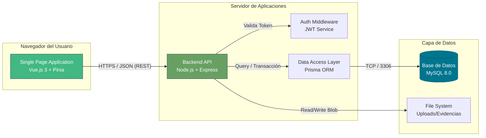

# 🏗️ Arquitectura de Software y Stack Tecnológico

> **Nivel de Abstracción:** Contenedores (C4 Level 2)
>
> Este documento detalla la interacción entre los componentes lógicos del sistema, las tecnologías seleccionadas y los patrones de diseño aplicados.

## 🔭 Visión General (Container Diagram)

El sistema sigue una arquitectura **Monolítica Modular Desacoplada** (Decoupled Monolith). El Frontend (SPA) y el Backend (API) están separados físicamente pero residen en el mismo repositorio (Monorepo) para facilitar el desarrollo.

---

## 🛠️ Stack Tecnológico (MEVN)

### 1. Frontend: Vue.js 3 (Composition API)
*   **Justificación:** Se eligió Vue 3 por su rendimiento superior y la **Composition API**, que permite reutilizar lógica de negocio (Composables) mejor que React Hooks en escenarios complejos.
*   **UI Framework:** PrimeVue (Tema Aura). Provee componentes empresariales robustos (DataTables, DatePickers) reduciendo el tiempo de desarrollo UI en un 60%.
*   **State Management:** Pinia. Gestiona el estado de sesión (Usuario, Permisos) y caché de catálogos.

### 2. Backend: Node.js + Express
*   **Modelo de Concurrencia:** Non-blocking I/O. Ideal para una aplicación intensiva en I/O (lectura de inventario, reportes) más que en CPU.
*   **Seguridad:** Implementación de **Helmet** para cabeceras HTTP seguras, **Rate Limiting** para mitigar DDoS y **CORS** estricto.

### 3. Capa de Datos: MySQL + Prisma ORM
*   **Motor:** MySQL 8.0 (ACID Compliant). Crítico para asegurar que una asignación de equipo no quede en estado inconsistente.
*   **ORM:** Prisma.
    *   *Type Safety:* Genera tipos TypeScript/JSDoc automáticamente basados en el esquema de la BD.
    *   *Migrations:* Control de versiones de la estructura de la base de datos.
    *   *Seguridad:* Previene SQL Injection por diseño al usar consultas parametrizadas internamente.

---

## 🧩 Patrones de Diseño Implementados

### Backend (MVC Adaptado)
*   **Routes:** Solo definición de endpoints.
*   **Controllers:** Lógica de negocio y orquestación.
*   **Services/Repositories:** (Implementado via Prisma) Abstracción de datos.

### Frontend
*   **Smart vs Dumb Components:** Separación entre componentes que manejan lógica (Vistas) y componentes puramente visuales (UI).
*   **Composables:** Lógica reutilizable (ej. `useSwal` para alertas) extraída de los componentes.

---

## 🔒 Estrategia de Seguridad

1.  **Autenticación Stateless:** Tokens JWT firmados (HS256) con expiración. No se almacena estado de sesión en el servidor, permitiendo escalabilidad horizontal fácil.
2.  **Principio de Menor Privilegio:** La conexión a la BD usa un usuario específico, no `root` (en producción).
3.  **Sanitización:** Validación estricta de entradas en controladores para evitar XSS y SQL Injection.

---

## 🌐 Plan de Red y Despliegue

Consulte [PLAN_SEGMENTACION_RED.md](PLAN_SEGMENTACION_RED.md) y [GUIA_DESPLIEGUE.md](GUIA_DESPLIEGUE.md) para detalles de infraestructura.