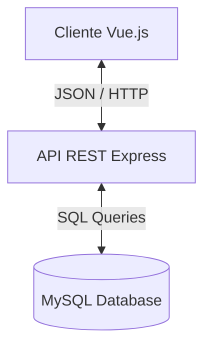

# 🏗️ Arquitectura y Stack Tecnológico

Este documento detalla **qué** tecnologías usamos, **por qué** las elegimos y **cómo** interactúan entre sí. Es fundamental para entender la filosofía de diseño del sistema.

---

## 🚀 Stack Tecnológico (MEVN)

Elegimos el stack **MEVN** (MySQL, Express, Vue, Node) por su modernidad, rendimiento y soporte comunitario.

### 🎨 Frontend (Cliente)

| Tecnología | Versión | Rol en el Proyecto | ¿Por qué esta opción? |
|:-----------|:--------|:-------------------|:----------------------|
| **Vue.js** | 3.x | Framework Reactivo | Ofrece la mejor curva de aprendizaje y utiliza `Composition API` (`<script setup>`) para un código más limpio y modular que React o Angular. |
| **Vite** | 5.x | Build Tool | Reemplazo moderno de Webpack. Arranca el servidor de desarrollo en milisegundos y optimiza el build final (tree-shaking). |
| **PrimeVue** | 4.0 | UI Component Library | Provee componentes empresariales listos (Tablas, Modales, Calendarios) con el tema "Aura" que da una apariencia premium inmediata. Evita escribir CSS desde cero. |
| **Pinia** | 2.x | State Management | Sucesor de Vuex. Maneja datos globales (Usuario logueado, Tema Dark/Light) sin la complejidad de reducers/mutations. |
| **Axios** | 1.x | Cliente HTTP | Maneja las peticiones AJAX al backend. Usamos interceptores para inyectar automáticamente el Token JWT en cada petición. |
| **TailwindCSS** | 3.x | Estilizado | Permite ajustes rápidos de diseño (`p-4`, `flex`, `text-center`) sin salir del HTML. |

### ⚙️ Backend (Servidor)

| Tecnología | Versión | Rol en el Proyecto | ¿Por qué esta opción? |
|:-----------|:--------|:-------------------|:----------------------|
| **Node.js** | 18+ | Runtime | Permite usar JavaScript en el servidor. Su modelo "Non-blocking I/O" es ideal para APIs que manejan muchas peticiones simultáneas ligeras. |
| **Express.js**| 4.x | Framework Web | Estándar de la industria. Minimalista y flexible. Maneja el ruteo (`GET /api/equipos`) y los Middlewares. |
| **MySQL** | 8.0 | Base de Datos | Necesitamos **Integridad Relacional** estricta (ACID) para inventarios. NoSQL (Mongo) no es adecuado aquí por las relaciones complejas (Equipos <-> Asignaciones <-> Empleados). |
| **MySQL2** | 3.x | Driver DB | Versión mejorada del driver mysql. Soporta `Promises` (`async/await`) nativamente y `Prepared Statements` para seguridad. |
| **JWT** | 9.x | Autenticación | JSON Web Tokens estandarizados. Stateless: El servidor no guarda sesión en memoria, lo que facilita reinicios sin desconectar usuarios. |

---

## 🏛️ Arquitectura de Software

El sistema sigue una arquitectura de **Cliente-Servidor (REST API)** desacoplada.

### 1. Patrón de Diseño Backend: MVC (Model-View-Controller)
Aunque usamos una API (sin "Views" HTML en backend), adaptamos el patrón:

*   **Rutas (`routes/`)**: Puerta de entrada. Solo definen URL y apuntan a un controlador.
*   **Controladores (`controllers/`)**: Cerebro. Contienen la lógica de negocio, validaciones y orquestación.
*   **Config/DB (`config/`)**: Capa de Acceso a Datos. Gestiona la conexión y queries directas.
    *   *Decisión:* No usamos un ORM (como Sequelize o TypeORM) para mantener control total sobre las consultas SQL y optimizar rendimiento.

### 2. Patrón de Diseño Frontend: Arquitectura Basada en Componentes

*   **Views (`views/`)**: Páginas completas (ej. `EquiposView`). Coordinan el layout.
*   **Components (`components/`)**: Piezas reutilizables (ej. `StatCard`, `TheSidebar`).
*   **Services (`services/`)**: Capa de abstracción de API. Los componentes nunca llaman a Axios directamente; llaman a `EquiposService.getAll()`. Esto permite cambiar el backend sin tocar la UI.
*   **Stores (`stores/`)**: Estado global reactivo.

---

## 🧠 Decisiones Clave de Diseño

### 1. "Soft Delete" vs "Hard Delete"
En tablas críticas (`equipos`, `empleados`), no borramos registros (`DELETE`). Cambiamos su `status_id` a "Baja/Inactivo".
*   **Por qué:** Para mantener integridad histórica. Si borramos un empleado, perderíamos el rastro de qué equipos tuvo asignados en el pasado.
*   *Excepción:* Tablas transaccionales erróneas o logs temporales.

### 2. Validaciones en Backend (Always Trust No One)
Aunque el frontend valida formularios, el backend **re-valida todo**.
*   **Por qué:** Un usuario malintencionado puede saltarse el frontend usando Postman. El controlador de Equipos verifica fechas, unicidad y formatos independientemente de la UI.

### 3. Segmentación de Red Lógica
Referencia: `docs/PLAN_SEGMENTACION_RED.md`.
La lógica de negocio valida IPs basándonos en la realidad física de la red de la empresa (segmentos /20). El software valida lo que la red física impone.

### 4. Seguridad
*   **Passwords:** Hasheados con `bcrypt`. Nunca se guardan en texto plano.
*   **SQL Injection:** Prevenido usando `?` (placeholders) en todas las queries.
*   **Variables de Entorno:** Credenciales DB y JWT Secret fuera del código fuente.

---

## 🔄 Flujo de una Nueva Funcionalidad (Ejemplo)

Para entender cómo viaja la información:

1.  **Usuario** hace clic en "Guardar Equipo".
2.  **Vue Component** captura datos -> Valida campos básicos.
3.  **Vue Service** envía `POST /api/equipos` con JSON.
4.  **Express Router** recibe -> Pasa a Middleware `auth` (¿Tiene Token?).
5.  **Controller** recibe -> Valida negocio (¿Duplicado? ¿Fecha válida?).
6.  **DB Driver** ejecuta `INSERT INTO equipos...`.
7.  **Controller** retorna JSON `{ id: 123, status: 'ok' }`.
8.  **Vue Component** recibe respuesta -> Muestra notificación "Éxito".

---

Este documento sirve como mapa mental para entender no solo qué hace el sistema, sino la filosofía de ingeniería detrás de él.
