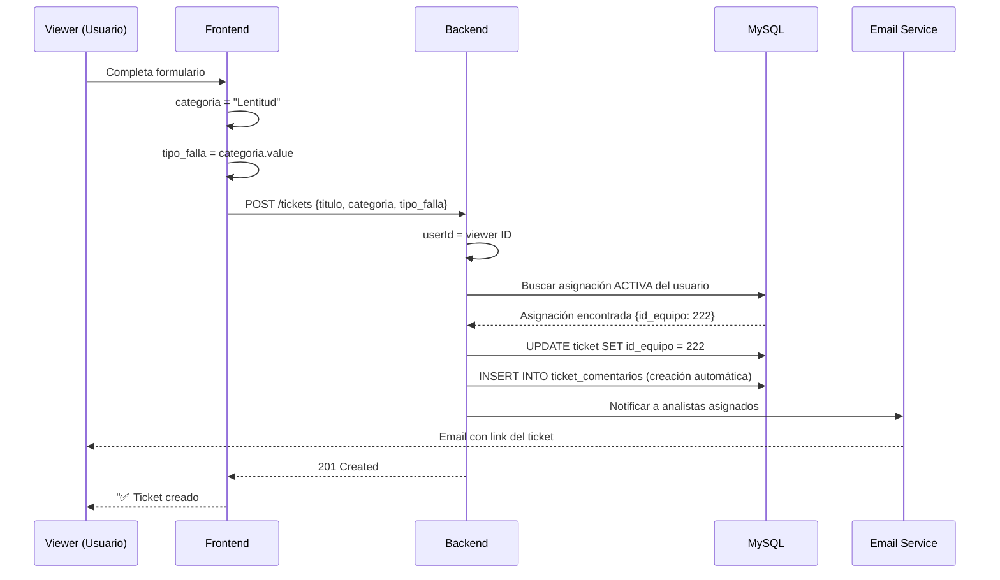
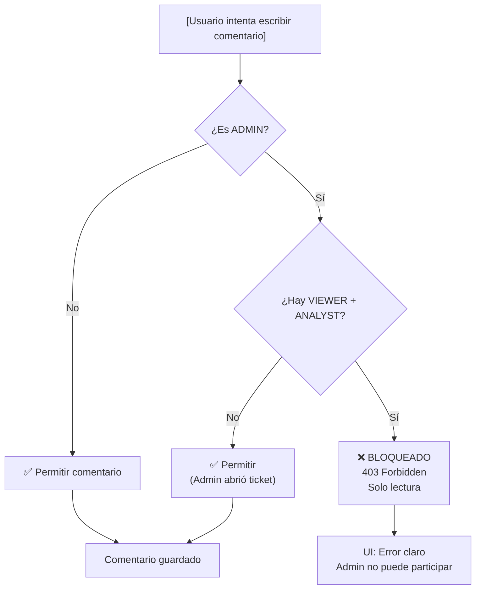
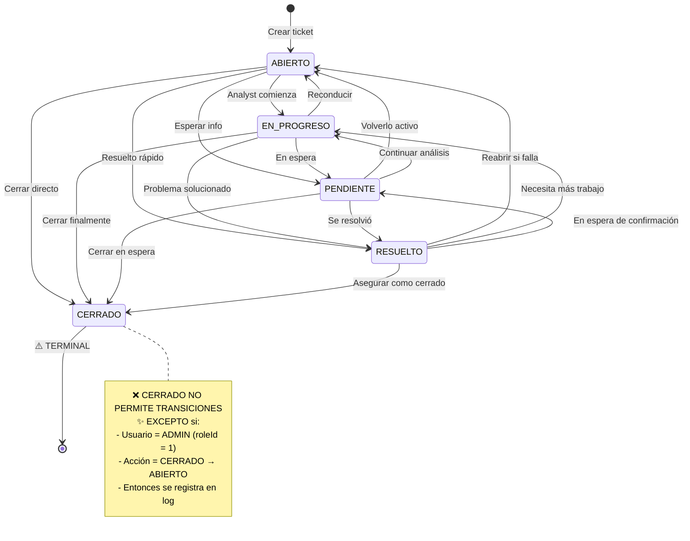

# 🎬 Flujos Visuales - Sistema de Tickets

> Diagramas de flujo y secuencias para entender intuitivamente cómo funciona el sistema

---

## 1️⃣ Creación de Ticket (Viewer/Usuario Externo)



**Resultado:**
```json
{
  "id": 10,
  "titulo": "Mi laptop está lenta",
  "categoria": "Lentitud",
  "tipo_falla": "SOFTWARE",
  "id_usuario_reporta": 7,
  "id_equipo": 222,        // ✨ Vinculado automáticamente
  "estatus": "ABIERTO",
  "email_reporta": "viewer@empresa.com"
}
```

---

## 2️⃣ Sincronización en Tiempo Real (Polling Coordinado)

```
SIDEBAR                 TICKETS VIEW            TICKETS DETAIL
(10s interval)          (15s interval)          (30s interval)
    │                        │                       │
    │ onMounted              │ onMounted             │ onMounted
    ├─────────────┐          ├─────────────┐         ├─────────────┐
    │             │          │             │         │             │
    ├→ 1s: load   │       ├→ 1s: load    │      ├→ 1s: load    │
    │             ├→ 10s  │             ├→ 15s │             ├→ 30s
    ├→ 11s: load  │       ├→ 16s: load  │      ├→ 31s: load  │
    │             │       │             │      │             │
    ├→ 21s: load  │    ├→ 31s: load    │      ├→ 61s: load  │
    │             │       │             │      │             │
    └─────────────┘       └─────────────┘      └─────────────┘

RESULTADO:
- Usuario siempre ve datos frescos (máx 30s de retraso)
- Carga del servidor distribuida
- No todo se refresca al mismo tiempo
```

### Mejor Visualización del Timing

```
TIMELINE:
0s   │ User abre pantalla
     ├─ Sidebar: LOAD (Banner activo)
     ├─ TicketsView: LOAD
     ├─ TicketsDetail: LOAD
     │
10s  ├─ Sidebar: REFRESH
20s  │
30s  ├─ Sidebar: REFRESH ─ TicketsDetail: REFRESH
40s  │
50s  │
60s  ├─ Sidebar: REFRESH ─ TicketsView: REFRESH
     ├─ TicketsDetail: REFRESH
     │
    [Analyst escribe comentario a los 65s]
65s  │ [Comentario guardado en BD]
     │
70s  ├─ TicketsDetail: REFRESH → ✨ Ve el nuevo comentario
80s  │ TicketsView: REFRESH
90s  ├─ TicketsDetail: REFRESH
     ├─ Sidebar: REFRESH (Contador actualizado)
```

---

## 3️⃣ Validación de Permisos (Admin no interfiere)



### Escenarios Reales

```
ESCENARIO 1: Admin abre ticket (sin usuario externo)
┌─────────────────────────────────┐
│ Ticket #1 (Admin abrió)         │
├─────────────────────────────────┤
│ id_usuario_reporta: NULL        │
│ id_asignado_a: 5 (Analyst)      │
├─────────────────────────────────┤
│ Admin intenta comentar:         │
│ → ¿VIEWER? NO                   │
│ → ✅ PERMITIDO                  │
└─────────────────────────────────┘

ESCENARIO 2: Viewer reporta con Analyst asignado
┌─────────────────────────────────┐
│ Ticket #10 (Viewer reportó)     │
├─────────────────────────────────┤
│ id_usuario_reporta: 7 (Viewer)  │
│ id_asignado_a: 5 (Analyst)      │
├─────────────────────────────────┤
│ [Conversation privada]          │
│ Viewer ↔ Analyst                │
├─────────────────────────────────┤
│ Admin intenta comentar:         │
│ → ¿VIEWER + ANALYST? SÍ         │
│ → ❌ BLOQUEADO                  │
│ Admin solo puede LEER           │
└─────────────────────────────────┘
```

---

## 4️⃣ Transiciones de Estado (CERRADO es Terminal)



### Ejemplo Práctico

```
Timeline de un Ticket:

10:00 - Admin abre ticket          → ABIERTO
10:15 - Analyst asignado           → EN_PROGRESO
10:30 - Necesita más info          → PENDIENTE
11:00 - Viewer responde            → EN_PROGRESO
12:00 - Problema solucionado       → RESUELTO
14:00 - Admin verifica             → CERRADO
15:00 - Usuario reporta que persiste
        Admin intenta reabrir       → ✅ PERMITIDO (solo admin)
15:05 - Ticket reabierto           → ABIERTO
15:10 - Analyst reinicia análisis  → EN_PROGRESO
```

---

## 5️⃣ Referencias de Email (Sincronización FRONTEND_URL)

```
EN DESARROLLO (localhost):
┌────────────────────────────────────┐
│ .env                               │
├────────────────────────────────────┤
│ FRONTEND_URL=http://localhost:3001 │
└────────────────────────────────────┘
        ↓
   Email generado:
   "Ver ticket: http://localhost:3001/tickets/10"
        ↓
   Viewer (interno en red) → ✅ Funciona
   Viewer (en internet) → ❌ No llega


EN PRODUCCIÓN (red interna):
┌─────────────────────────────────────────┐
│ .env                                    │
├─────────────────────────────────────────┤
│ FRONTEND_URL=http://192.168.1.100/soporte│
└─────────────────────────────────────────┘
        ↓
   Email generado:
   "Ver ticket: http://192.168.1.100/soporte/tickets/10"
        ↓
   Viewer (en red) → ✅ Funciona
   Viewer (fuera) → ❌ No accesible (esperado)


EN PRODUCCIÓN (internet):
┌─────────────────────────────────────────┐
│ .env                                    │
├─────────────────────────────────────────┤
│ FRONTEND_URL=https://tickets.empresa.com │
└─────────────────────────────────────────┘
        ↓
   Email generado:
   "Ver ticket: https://tickets.empresa.com/tickets/10"
        ↓
   Viewer (internet) → ✅ Funciona
   Viewer (red interna) → ✅ También funciona
```

### Cadena de Fallback si FRONTEND_URL no existe

```
getFrontendUrl() busca en este orden:
    ↓
1. process.env.FRONTEND_URL
    Si es undefined → Siguiente
    ↓
2. process.env.APP_URL
    Si es undefined → Siguiente
    ↓
3. process.env.API_URL
    Extrae: http://localhost:3000/api → http://localhost:3000
    ↓
4. Hardcoded fallback
    http://localhost:3000
    ⚠️ MALO: Emails con localhost
```

**Moraleja:** ✨ **SIEMPRE** definir `FRONTEND_URL` en .env en producción

---

## 6️⃣ Badge Visible en Sidebar (Posicionamiento)

```
SIDEBAR EXPANDIDO:
┌─────────────────────────────┐
│ SISTEMA DE INVENTARIO   [2] │ ← Badge visible
├─────────────────────────────┤
│ 🏠 Dashboard                │
│ 📦 Equipos                  │
│ 📝 Tickets                  │
│ 👥 Usuarios                 │
└─────────────────────────────┘

SIDEBAR COLAPSADO:
┌───┐
│[2]│  ← Badge sobresale (absolute -top-1 -right-1)
├───┤
│ 🏠│
│ 📦│
│ 📝│
│ 👥│
└───┘

CSS CRÍTICO:
├─ absolute: Posición relativa al contenedor
├─ -top-1: Sube 4px (para que sobresalga)
├─ -right-1: Desplaza 4px a la derecha
├─ z-index: 50: Siempre encima
├─ bg-red-500: Rojo llamativo
├─ rounded-full: Círculo perfecto
└─ min-w-fit: Ocupa lo necesario (número)

RESULTADO:
- ✅ Visible con sidebar expandido
- ✅ Visible con sidebar colapsado
- ✅ No se corta ni desaparece
- ✅ Parece "saltar" del icono
```

---

## 7️⃣ Equipment Details Panel (Cuando se Muestra)

```
Ticket #10 - "Mi laptop está lenta"
═══════════════════════════════════

[Conversación de comentarios...]

┌──────────────────────────────────┐
│ 🔷 EQUIPO RELACIONADO           │  ← Se muestra si:
├──────────────────────────────────┤     - ticket.equipos existe
│ ID EQUIPO        222             │     - El usuario tiene equipo
│ MARCA            DELL            │       asignado
│ MODELO           VOSTRO 3458     │
│ SERIE            ABC123DEF       │  ← Datos de equipos table
│ NOMBRE           DESKTOP-JUAN    │
│                                  │
│ IP ASIGNADA      192.168.1.50    │  ← Datos de asignaciones
└──────────────────────────────────┘     + direcciones_ip

QUERY QUE LO GENERA:
┌────────────────────────────────────────────┐
│ SELECT * FROM tickets WHERE id = 10       │
│ → Incluye: equipos { ... }                 │
│                                            │
│ LUEGO (si tiene equipo):                   │
│ SELECT * FROM asignaciones WHERE:          │
│   - id_equipo = 222                        │
│   - fecha_fin_asignacion IS NULL           │
│   - id_status_asignacion = 1               │
│ → Incluye: direcciones_ip { direccion_ip } │
└────────────────────────────────────────────┘

SIN EQUIPO:
- ❌ Panel no aparece
- Usuario reportó sin equipo asignado

SIN IP:
- ✅ Panel aparece
- ⚠️ IP muestra "N/A"
- Equipo en inventario pero sin red
```

---

## 📊 Matriz de Visibilidad

```
QUIEN VE QUE COMENTARIO:

Comentario 1: Viewer escribe "Laptop lenta"
├─ Viewer: ✅ Ve su propio comentario
├─ Analyst asignado: ✅ Ve para analizar
└─ Admin: ✅ Ve (solo lectura si hay Analyst)

Comentario 2: Analyst escribe "Revisar drivers"
├─ Viewer: ✅ Ve (lo que necesita saber)
├─ Analyst: ✅ Ve su análisis
└─ Admin: ✅ Ve (solo lectura)

Comentario 3: Admin escribe "..."
├─ Viewer: ❌ NO VE (Admin bloqueado)
├─ Analyst: ❌ NO VE (Admin bloqueado)
└─ Admin: ✅ Lo escribió (pero fallará)
         Error: 403 Forbidden
         "Admin no puede participar..."
```

---

## 🔄 Ciclo de Vida Completo

```
USUARIO               SISTEMA                    EMAIL/NOTIF
│                     │                          │
├─ Crea ticket       ─→ Genera ID #10           │
│                     ├─ Vincula equipo         │
│                     ├─ Busca asignación       │
│                     └─ Envía email            ←─ "Nuevo ticket #10"
│                     │                          │
├─ Espera respuesta   │ (Polling: 10s sidebar)   │
│                     │ (Polling: 30s detail)   │
│                     │                          │
│                  ← Analyst recibe → Ingresa al sistema
│                     ├─ Lee comentarios
│                     ├─ Responde "En revisión"
│                     └─ Cambia estado         
│                     │                         ↓ Email notif
│ ← Ve notificación    │ (Poll tick cada 30s)
│                     ├─ Descarga info equipo
│                     └─ Necesita IP
│                     │ → 192.168.1.50        
│                     │ Conecta remoto...
│                     │                        
├─ Lo contacta       ← Lee comentario "Revisar antivirus"
│                     │
├─ Soluciona      ─→ Escribe "Problema resuelto"
│                     ├─ Cambia a RESUELTO
│                     └─ Pero NO CIERRA
│                     │
├─ Da OK             │ Admin verifica
│                     ├─ Lee ticket
│                     └─ CERRADO terminal    → "Ticket cerrado"
│                     │
├─ [Persistente]  ─→ Admin hace: CERRADO → ABIERTO
│                     ├─ Reabre ticket
│                     └─ Notifica analyst
│                     │
                     Cycle vuelve a EN_PROGRESO
```

---

Esta es la documentación visual completa. Cada diagrama representa un aspecto diferente del sistema. 🎯
