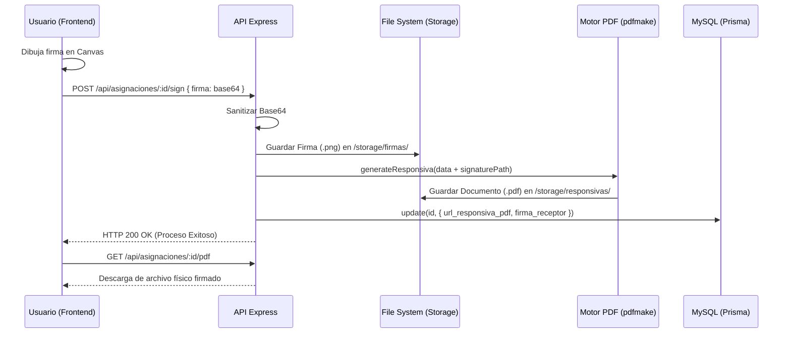

# 📘 Manual de Funcionamiento Técnico

> **Ecosistema: Sistema de Inventario TI & Soporte**
> 
> Este documento describe la lógica interna, el flujo de datos y las mecánicas de software que rigen la aplicación. Es una guía de referencia para entender cómo interactúan los componentes del Stack MEVN.

---

## 1. 🔐 Seguridad y Autenticación (JWT Flow)

El sistema utiliza una arquitectura de autenticación **Stateless** basada en JSON Web Tokens (JWT).

### Flujo de Inicio de Sesión
1.  **Solicitud:** El usuario envía `username` y `password` a `/api/auth/login`.
2.  **Validación:** El servidor verifica las credenciales y genera un token firmado con `JWT_SECRET`.
3.  **Entrega:** El servidor responde con el token y los datos básicos del usuario (rol, nombre).
4.  **Persistencia:** El cliente (Vue) guarda el token en `localStorage` y lo inyecta en el estado global de **Pinia**.

### Protección de Rutas (Middleware)
*   **`protect`:** Middleware que intercepta las peticiones al backend, verifica que el header `Authorization: Bearer <token>` sea válido y decodifica la identidad del usuario.
*   **`isSupportOrAdmin`:** Filtro de autorización que bloquea acciones de escritura para usuarios con roles de solo lectura.

---

## 2. 🏗️ Arquitectura del Backend (API REST)

El backend está diseñado siguiendo el principio de **Separación de Responsabilidades**.

### Estructura de una Petición
1.  **Route:** Define el endpoint (ej. `POST /api/equipos`).
2.  **Middleware:** Valida autenticación y permisos.
3.  **Schema Validation (Zod):** Antes de procesar, se valida que el cuerpo de la petición (`req.body`) cumpla con el esquema técnico (ej. que el `numero_serie` sea string y no esté vacío).
4.  **Controller:** Orquesta la lógica. Llama al servicio correspondiente y maneja las respuestas HTTP (`200 OK`, `400 Bad Request`, `500 Error`).
5.  **Service:** Realiza la comunicación con la base de datos a través de **Prisma ORM**.
6.  **Logger:** Cada operación importante (éxito o error) se registra en consola y archivos de log para depuración.

---

## 3. 🎨 Funcionamiento del Frontend (Vue SPA)

### Comunicación con la API
*   **Axios Interceptors:** Contamos con un cliente HTTP centralizado en `services/api.js`.
    *   **Request Interceptor:** Adjunta automáticamente el token JWT del `localStorage` a cada salida.
    *   **Response Interceptor:** Si detecta un error `401` (sesión expirada), fuerza un logout y redirige al usuario al login para proteger el sistema.

### Gestión de Estado (Pinia)
*   **Auth Store:** Mantiene la reactividad de la sesión. Si el usuario cambia su nombre en el perfil, se actualiza en toda la interfaz instantáneamente sin recargar la página.
*   **Theme Store:** Gestiona la preferencia de modo oscuro/claro de forma persistente.

---

## 4. 🎫 Sistema de Soporte y QR (Fase 2)

Una de las características innovadoras es el flujo de soporte desacoplado.

1.  **Generación de QR:** Cada equipo registrado tiene un `qr_token` único y aleatorio generado automáticamente por el servidor.
2.  **Acceso Público:** Al escanear el QR, el sistema redirige a una landing page pública (`/q/:token`).
3.  **Reporte de Falla (Wizard):** El usuario interactúa con un asistente paso a paso diseñado con principios de accesibilidad para adultos mayores (iconos grandes, lenguaje no técnico).
4.  **Seguimiento:** El reportante recibe un token de seguimiento para consultar el estado de su ticket sin loguearse.

### 4.1 Accesibilidad y Entrada Manual (Portal de Ayuda)
Para garantizar la operatividad en casos donde el hardware de captura (cámara/celular) no esté disponible:
- **Ruta de Emergencia:** Se habilitó `/ayuda` para entrada manual de códigos.
- **Etiqueta Híbrida:** La etiqueta impresa incluye tanto el QR como el código corto e instrucciones paso a paso.
- **Interfaz Adaptativa:** El sistema detecta el dispositivo y ajusta el layout (Vertical para móviles, Split-View para escritorio).

### 4.2 Mapa de Rutas Públicas (Endpoints)
El sistema expone los siguientes puntos de acceso que no requieren autenticación JWT:

| Propósito | URL Interna (Router) | URL Pública (Producción) |
| :--- | :--- | :--- |
| **Landing QR** | `/q/:token` | `.../soporte/q/:token` |
| **Ayuda Manual** | `/ayuda` | `.../soporte/ayuda` |
| **Seguimiento** | `/q/ticket/:token` | `.../soporte/q/ticket/:token` |
| **Acceso Admin** | `/login` | `.../soporte/login` |

### 4.3 Comunicación Bidireccional
El sistema permite un hilo de conversación transparente:
- **Comentarios del Técnico:** Se registran desde el panel administrativo y son visibles para el usuario en la vista de seguimiento.
- **Comentarios del Usuario:** Se registran desde la vista pública y son inyectados en el panel administrativo con un prefijo de autor (`[Nombre]:`) para su correcta identificación por el técnico.

---

## 5. ✍️ Firma Digital y Documentos Legales

El sistema cierra el ciclo administrativo mediante la generación de documentos con validez institucional.

### Flujo de Firma y Generación (Diagrama de Secuencia)

### Mecánica de Captura (SignaturePad)
1.  **Captura:** El frontend utiliza un componente `SignaturePad` basado en **Canvas HTML5** para registrar el trazo del usuario.
2.  **Transmisión:** La firma se envía al servidor como una cadena **Base64 (image/png)**.
3.  **Persistencia Física:** El servidor convierte el Base64 en un archivo `.png` físico y lo almacena en `/storage/firmas/`.
4.  **Incrustación:** El motor `pdfmake` toma la imagen del disco y la estampa en las coordenadas exactas sobre el nombre del receptor en la Hoja de Resguardo.

### Almacenamiento Privado (Vault)
A diferencia de las fotos de perfil, las firmas y los PDFs firmados se guardan en la carpeta `/server/storage/`, la cual:
- **No es pública:** No se puede acceder via URL directa.
- **Acceso Controlado:** Solo los usuarios autenticados con JWT pueden solicitar la descarga a través del servidor.
- **Resiliencia:** Si el archivo se elimina del disco, el backend limpia el registro en la DB automáticamente para permitir una nueva firma.

---

## 6. 🗄️ Gestión de Base de Datos y Auditoría

### Integridad Referencial
El sistema utiliza claves foráneas estrictas. Por ejemplo, no se puede eliminar una `Empresa` si tiene `Sucursales` activas, protegiendo la consistencia de los reportes.

### Auditoría Forense (`logs_sistema`)
Cuando un administrador realiza cambios sensibles (editar un equipo, dar de baja un empleado), un middleware de auditoría captura:
*   **Quién:** ID del usuario.
*   **Qué:** Valores anteriores vs. Valores nuevos (en formato JSON).
*   **Dónde:** Dirección IP y Navegador.
*   **Cuándo:** Marca de tiempo exacta.

---

## 🚀 Resumen de Comandos de Operación

*   `npm run setup`: Prepara todo el ecosistema (Instalación + Prisma).
*   `npm run dev`: Inicia el modo desarrollo.
*   `npx prisma studio`: Abre una interfaz visual para explorar la base de datos MySQL de forma segura.
