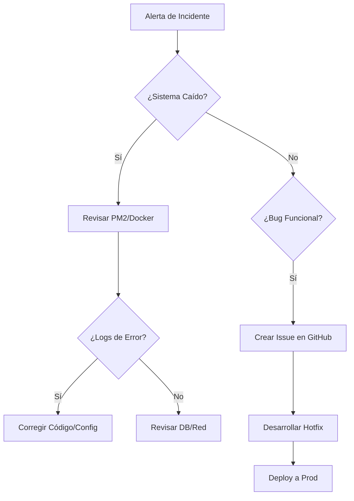

# 📘 Manual de Operaciones y Mantenimiento (O&M)

> **Continuidad del Negocio:** Procedimientos críticos para la administración, respaldo y resolución de incidentes del Sistema de Inventario TI.

---

## 🗄️ Gestión de Datos (Disaster Recovery)

La integridad de la base de datos MySQL es el activo más crítico. Se deben seguir estos protocolos para evitar la pérdida de información.

### 1. Estrategia de Backups
Se recomienda un esquema de respaldo **Diario (Incremental)** y **Semanal (Full)**.

**Backup Manual Completo:**
```bash
# Exportar estructura y datos
mysqldump -u [usuario] -p --single-transaction --quick --lock-tables=false inventario_soporte > backup_$(date +%Y%m%d).sql
```

**Restauración Crítica:**
1. Crear base de datos vacía: `CREATE DATABASE inventario_soporte;`
2. Importar dump: `mysql -u [usuario] -p inventario_soporte < backup_archivo.sql`
3. Sincronizar Prisma (regenerar cliente): `npx prisma generate`

### 2. Mantenimiento Preventivo (DB)
Ejecutar mensualmente para optimizar índices y reclamar espacio:
```sql
OPTIMIZE TABLE equipos, asignaciones, tickets, logs_sistema;
```

---

## 🔧 Resolución de Incidentes (Troubleshooting)

### Nivel 1: Conectividad
*   **Error:** `Network Error` / `ECONNREFUSED`
    *   **Causa:** Backend caído o puerto 3000 bloqueado por firewall.
    *   **Acción:** Ejecutar `pm2 list` (prod) o verificar consola (dev). Si el proceso está en `errored`, revisar logs con `pm2 logs`.
*   **Error:** `403 Forbidden` (CORS)
    *   **Causa:** Petición desde un dominio no autorizado (ej. IP diferente a `localhost` o dominio producción).
    *   **Acción:** Verificar la variable `CORS_ORIGIN` en el `.env` del servidor.

### Nivel 2: Aplicación
*   **Error:** `Token Expired` / `401 Unauthorized`
    *   **Causa:** El JWT ha expirado o el `JWT_SECRET` fue modificado.
    *   **Acción:** El sistema forzará logout. Si el problema persiste para todos, verificar sincronización de hora del servidor (`ntp`).
*   **Error:** `PrismaClientKnownRequestError`
    *   **Causa:** Inconsistencia entre el código y la base de datos (migraciones pendientes).
    *   **Acción:** Ejecutar `npx prisma migrate deploy --schema prisma/schema.prisma` para aplicar cambios pendientes en producción.
*   **Error:** `MulterError: File too large`
    *   **Causa:** Intento de subida de archivo mayor a 5MB.
    *   **Acción:** El cliente debe comprimir el archivo. No se recomienda aumentar el límite por seguridad.

---

## 🔑 Gestión de Secretos y Configuración

El sistema depende estrictamente de las variables de entorno. 

| Variable | Impacto si se pierde | Acción de Recuperación |
| :--- | :--- | :--- |
| `DATABASE_URL` | Pérdida total de servicio. | Restaurar conexión string a MySQL. |
| `JWT_SECRET` | Invalida todas las sesiones activas. | Generar uno nuevo; los usuarios deberán re-loguearse. |
| `FRONTEND_URL` | Problemas de CORS. | Actualizar dominio en `.env`. |

---

## 📅 Calendario de Mantenimiento Sugerido

| Tarea | Frecuencia | Responsable |
| :--- | :--- | :--- |
| Revisión de logs en `server/logs/` | Semanal | Administrador TI |
| Rotación de logs de servidor (`pm2 flush`) | Mensual | DevOps/Soporte |
| Prueba de restauración de Backup (Sandbox) | Trimestral | DevOps |
| Actualización de dependencias (`npm audit`) | Trimestral | Desarrollador |

## 🧱 Flujo Prisma Recomendado

### Desarrollo
```bash
cd server
npx prisma migrate dev --schema prisma/schema.prisma
```

### Producción o servidor remoto
```bash
cd server
npx prisma migrate deploy --schema prisma/schema.prisma
```

### Verificación del estado
```bash
cd server
npx prisma migrate status --schema prisma/schema.prisma
```

Si la base ya existe y no fue creada con Prisma, primero se debe baselinear o registrar el estado antes de volver a desplegar migraciones.

---

## 🚨 Flujo de Respuesta a Incidentes (Mermaid)


