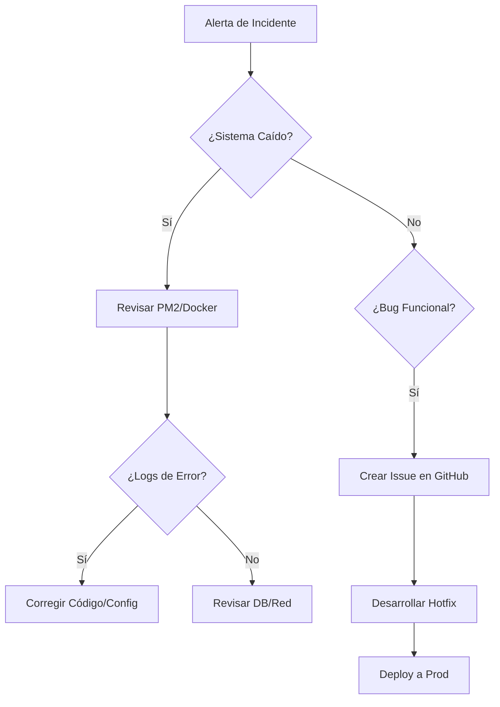

# 📘 Manual de Operaciones y Mantenimiento (O&M)

> **Continuidad del Negocio:** Procedimientos críticos para la administración, respaldo y resolución de incidentes del Sistema de Inventario TI.

---

## 🗄️ Gestión de Datos (Disaster Recovery)

La integridad de la base de datos MySQL es el activo más crítico. Se deben seguir estos protocolos para evitar la pérdida de información.

### 1. Estrategia de Backups
Se recomienda un esquema de respaldo **Diario (Incremental)** y **Semanal (Full)**.

**Backup Manual Completo:**
```bash
# Exportar estructura y datos
mysqldump -u [usuario] -p --single-transaction --quick --lock-tables=false inventario_soporte > backup_$(date +%Y%m%d).sql
```

**Restauración Crítica:**
1. Crear base de datos vacía: `CREATE DATABASE inventario_soporte;`
2. Importar dump: `mysql -u [usuario] -p inventario_soporte < backup_archivo.sql`
3. Sincronizar Prisma (regenerar cliente): `npx prisma generate`

### 2. Mantenimiento Preventivo (DB)
Ejecutar mensualmente para optimizar índices y reclamar espacio:
```sql
OPTIMIZE TABLE equipos, asignaciones, tickets, logs_sistema;
```

---

## 🔧 Resolución de Incidentes (Troubleshooting)

### Nivel 1: Conectividad
*   **Error:** `Network Error` / `ECONNREFUSED`
    *   **Causa:** Backend caído o puerto 3000 bloqueado por firewall.
    *   **Acción:** Ejecutar `pm2 list` (prod) o verificar consola (dev). Si el proceso está en `errored`, revisar logs con `pm2 logs`.
*   **Error:** `403 Forbidden` (CORS)
    *   **Causa:** Petición desde un dominio no autorizado (ej. IP diferente a `localhost` o dominio producción).
    *   **Acción:** Verificar la variable `CORS_ORIGIN` en el `.env` del servidor.

### Nivel 2: Aplicación
*   **Error:** `Token Expired` / `401 Unauthorized`
    *   **Causa:** El JWT ha expirado o el `JWT_SECRET` fue modificado.
    *   **Acción:** El sistema forzará logout. Si el problema persiste para todos, verificar sincronización de hora del servidor (`ntp`).
*   **Error:** `PrismaClientKnownRequestError`
    *   **Causa:** Inconsistencia entre el código y la base de datos (migraciones pendientes).
    *   **Acción:** Ejecutar `npx prisma migrate deploy --schema prisma/schema.prisma` para aplicar cambios pendientes en producción.
*   **Error:** `MulterError: File too large`
    *   **Causa:** Intento de subida de archivo mayor a 5MB.
    *   **Acción:** El cliente debe comprimir el archivo. No se recomienda aumentar el límite por seguridad.

---

## 🔑 Gestión de Secretos y Configuración

El sistema depende estrictamente de las variables de entorno. 

| Variable | Impacto si se pierde | Acción de Recuperación |
| :--- | :--- | :--- |
| `DATABASE_URL` | Pérdida total de servicio. | Restaurar conexión string a MySQL. |
| `JWT_SECRET` | Invalida todas las sesiones activas. | Generar uno nuevo; los usuarios deberán re-loguearse. |
| `FRONTEND_URL` | Problemas de CORS. | Actualizar dominio en `.env`. |

---

## 📅 Calendario de Mantenimiento Sugerido

| Tarea | Frecuencia | Responsable |
| :--- | :--- | :--- |
| Revisión de logs en `server/logs/` | Semanal | Administrador TI |
| Rotación de logs de servidor (`pm2 flush`) | Mensual | DevOps/Soporte |
| Prueba de restauración de Backup (Sandbox) | Trimestral | DevOps |
| Actualización de dependencias (`npm audit`) | Trimestral | Desarrollador |

## 🧱 Flujo Prisma Recomendado

### Desarrollo
```bash
cd server
npx prisma migrate dev --schema prisma/schema.prisma
```

### Producción o servidor remoto
```bash
cd server
npx prisma migrate deploy --schema prisma/schema.prisma
```

### Verificación del estado
```bash
cd server
npx prisma migrate status --schema prisma/schema.prisma
```

Si la base ya existe y no fue creada con Prisma, primero se debe baselinear o registrar el estado antes de volver a desplegar migraciones.

---

## 🚨 Flujo de Respuesta a Incidentes (Mermaid)



---

## 🎫 Módulo de Tickets (Actualización Técnica Integral)

Esta sección documenta los ajustes recientes aplicados al flujo de tickets para asegurar consistencia funcional, reglas claras por rol y sincronización en tiempo real.

### 1. Arquitectura Funcional Actual

El flujo del módulo sigue esta secuencia:

1. Frontend crea/consulta ticket mediante `client/src/services/TicketsService.js`.
2. Backend recibe en `server/src/controllers/tickets.controller.js`.
3. Reglas de negocio se validan en `server/src/services/tickets.service.js`.
4. Si aplica, se emiten notificaciones por correo desde `server/src/services/ticketNotification.service.js`.

### 2. Reglas de Negocio Críticas Implementadas

#### 2.1 Estado `CERRADO` terminal

- `CERRADO` no permite transiciones para usuarios no admin.
- Excepción controlada: solo `ADMIN` puede ejecutar `CERRADO -> ABIERTO` (reapertura).
- Si un ticket está en `RESUELTO` o `CERRADO`, no acepta nuevos comentarios ni adjuntos.

Referencia de código:

- `TicketService.validateStatusTransition(...)`
- `TicketService.addComment(...)`
- `TicketService.addAttachment(...)`

#### 2.2 Asignación automática de equipo para solicitante (`VIEWER`)

Al crear ticket como usuario final:

- Se busca su asignación activa (`fecha_fin_asignacion = null`, `id_status_asignacion = 1`).
- Se vincula automáticamente ese equipo al ticket (`id_equipo`).
- Si no tiene equipo activo, el ticket se crea sin relación de equipo.

Referencia de código:

- `TicketService.resolveTicketEquipo(...)`

#### 2.3 Prioridad crítica restringida

- `VIEWER` no puede fijar `CRITICA`.
- `ADMIN/ANALYST` sí pueden manejar prioridad crítica.

Referencia de código:

- `TicketService.resolveCreatePriority(...)`
- `client/src/views/TicketCreateView.vue`

### 3. Sincronización en Tiempo Real (Polling Coordinado)

Se definió un esquema por pantalla para balancear UX y carga:

- Sidebar (`TheSidebar.vue`): cada `10s` para badge de tickets.
- Lista (`TicketsView.vue`): cada `15s` para tabla de tickets activos.
- Detalle (`TicketsDetailView.vue`): cada `30s` para conversación y estado.

Buenas prácticas aplicadas:

- Carga inmediata antes de iniciar intervalo.
- Limpieza en `onUnmounted` para evitar memory leaks.
- Reinicio de polling al cambiar usuario/rol cuando aplica.

### 4. Badge Inteligente por Rol

Lógica final del badge en sidebar (no leídos):

- `ADMIN`: cuenta tickets no leídos sin asignar y no finalizados (`CERRADO/RESUELTO`).
- `ANALYST`: cuenta tickets no leídos asignados al analista y no finalizados (`CERRADO/RESUELTO`).
- `VIEWER`: no muestra badge.

Regla de no leídos:

- El badge se calcula contra `lastSeenAt` por usuario y rol, persistido en `localStorage`.
- El timestamp de comparación se basa en datos del servidor (`fecha_actualizacion` o `fecha_creacion`), evitando desajustes por reloj local.
- Al entrar a rutas `/tickets`, el sistema marca como visto el snapshot actual de tickets relevantes.

Visual:

- Visible también en modo colapsado.
- Tope visual `99+`.

### 5. Tipo de Falla y Creación de Ticket

Corrección aplicada en frontend y backend:

- Se dejó de enviar `tipo_falla: 'OTRO'` fijo.
- Ahora `tipo_falla` se deriva de la categoría seleccionada.
- En backend se aplica fallback robusto para normalizar categoría -> enum técnico (`HARDWARE`, `SOFTWARE`, `RED`, `IMPRESORA`, `OTRO`) aunque el cliente envíe texto amigable.

Objetivo:

- Mejor trazabilidad por categoría real.
- Reportes de soporte más confiables.

### 6. Detalle de Equipo en Ticket

En `TicketsDetailView` se muestra el bloque de equipo cuando existe `ticket.equipos`:

- ID equipo
- Marca
- Modelo
- Serie
- Nombre de equipo
- IP asignada (si existe)

La IP se obtiene con query adicional en backend para evitar errores de include anidado complejo en Prisma.

Implementación backend:

- `TicketService.findById(...)`:
  - Carga ticket base.
  - Si hay equipo, consulta `asignaciones` activas (`take: 1`, orden desc por fecha).
  - Incluye `direcciones_ip`.
  - Mapea resultado a `ticket.equipos.asignaciones`.

### 7. Política de Comentarios

Estado actual del producto:

- La UI de “Nota interna” fue removida del detalle de ticket.
- El envío desde UI se realiza como comentario normal.
- Se mantiene compatibilidad backend con campo `es_interno` para datos históricos.

Notas operativas:

- Comentarios históricos con `es_interno = true` pueden existir en base.
- El backend conserva estructura para no romper compatibilidad ni reportes anteriores.

### 8. Notificaciones por Correo

#### 8.1 Resolución de URL frontend

Prioridad para construir links en correos:

1. `FRONTEND_URL`
2. `APP_URL`
3. Derivación de `API_URL`

Recomendación de operación:

- Configurar siempre `FRONTEND_URL` explícito en producción para evitar enlaces ambiguos.

#### 8.2 Casos de notificación

- Nuevo ticket a administración/soporte.
- Confirmación de ticket creado al solicitante (cuando existe correo asociado).
- Comentarios públicos de soporte hacia solicitante.
- Comentario de solicitante hacia analista asignado.
- Reapertura por admin (cuando aplica en transición).

Política actual recomendada (anti saturación):

- Priorizar correos transaccionales (creación, asignación, cambio de estatus, reapertura).
- Mantener notificación web (badge) como canal primario para actividad frecuente.
- Evitar estrategia de correo por cada mensaje en conversaciones activas.

### 9. Matriz de Permisos Simplificada

| Acción | VIEWER (2) | ANALYST (3) | ADMIN (1) |
| :--- | :---: | :---: | :---: |
| Crear ticket | ✅ | ❌ | ✅ |
| Ver todos los tickets | ❌ (solo propios) | ✅ | ✅ |
| Cambiar estatus | ❌ | ✅ | ✅ |
| Asignar técnico | ❌ | ❌ | ✅ |
| Definir prioridad crítica | ❌ | ✅ | ✅ |
| Reabrir `CERRADO` | ❌ | ❌ | ✅ |

### 10. Checklist de Validación Post-Deploy

1. Crear ticket como `VIEWER` y validar vínculo automático de equipo (si tiene asignación activa).
2. Confirmar que `tipo_falla` coincide con la categoría elegida.
3. Verificar badge en sidebar:
    - Admin: sin asignar.
    - Analista: asignados a sí mismo.
4. Validar polling en las tres vistas (10s/15s/30s).
5. Probar transición `CERRADO -> ABIERTO`:
    - Admin permitido.
    - No admin bloqueado.
6. Confirmar que el panel de equipo en detalle muestra IP cuando existe.
7. Revisar enlaces de correo apuntando a `FRONTEND_URL` correcto.
