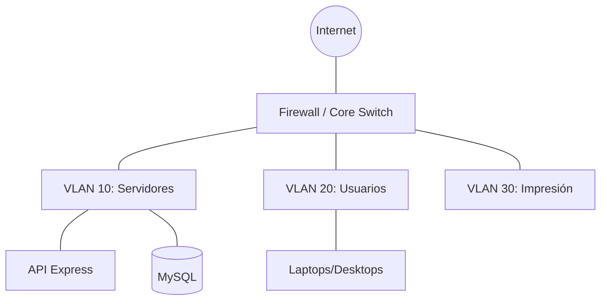

# 🌐 Plan de Segmentación y Direccionamiento de Red

> **Infraestructura Lógica:** Definición de la topología de red, rangos IP y políticas de acceso para el ecosistema TI.

---

## 🏗️ Arquitectura de Red (VLANs)

El sistema está diseñado para operar en una red corporativa segmentada, garantizando que los activos críticos estén aislados del tráfico de invitados o servicios externos.

### Segmentos de Red Corporativa
| Segmento | Rango IP (CIDR) | Propósito |
| :--- | :--- | :--- |
| **VLAN 10: Gestión** | `10.10.10.0/24` | Servidores, Bases de Datos, API. |
| **VLAN 20: Usuarios** | `10.10.20.0/22` | Equipos de cómputo (Laptops, Desktops) de empleados. |
| **VLAN 30: Impresión**| `10.10.30.0/24` | Impresoras, Multifuncionales, Scanners. |
| **VLAN 40: CCTV** | `10.10.40.0/24` | Cámaras y NVRs. |
| **VLAN 90: Invitados**| `172.16.10.0/24` | Dispositivos externos (Acceso limitado a Internet). |

---

## 📍 Políticas de Direccionamiento (IPAM)

El módulo de **Direcciones IP** del sistema sigue estas reglas de asignación:

1.  **IPs Estáticas (`Reserved`):** 
    - Reservadas para Gateway (`.1`), Switches (`.2 - .10`) y Servidores (`.11 - .50`).
2.  **IPs Dinámicas (DHCP/Pool):** 
    - Rango `.100` al `.250` para equipos de usuario.
3.  **Manejo de Conflictos:**
    - El sistema bloquea la asignación de una IP si ya existe un registro `Activo` vinculado a otro `equipo_id`.

---

## 🛡️ Seguridad Perimetral (Firewall Rules)

Para el correcto funcionamiento del sistema MEVN, el firewall debe permitir:

| Origen | Destino | Puerto | Protocolo | Servicio |
| :--- | :--- | :--- | :--- | :--- |
| VLAN 20 | VLAN 10 | `3000` | TCP | Acceso a la API REST |
| VLAN 10 | Internet | `443` | TCP | Notificaciones Email / Updates |
| localhost| VLAN 10 | `3306` | TCP | Conexión App -> DB |

---

## 📊 Visualización de Topología

