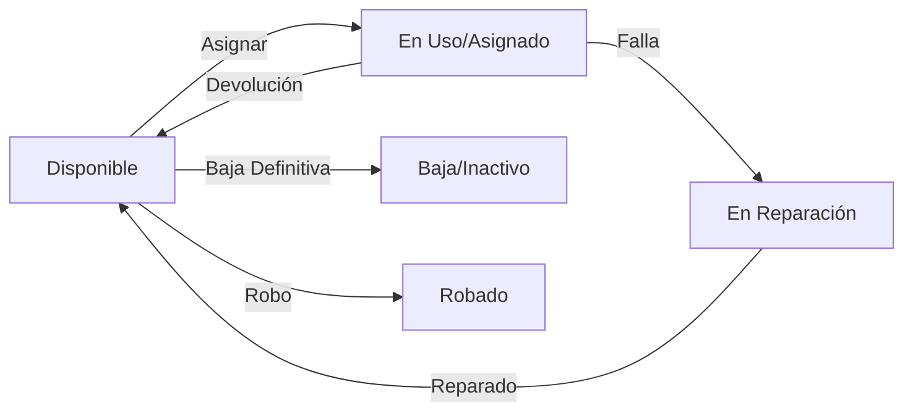

# 🔄 Reglas de Negocio y Flujos Operativos

Este documento describe la lógica de negocio del sistema, crucial para entender cómo interactúan los módulos más allá del código.

---

## 🖥️ 1. Ciclo de Vida de Activos (Equipos)

Un activo tecnológico (Laptop, Impresora, etc.) pasa por diferentes estados controlados por el sistema:

### Diagrama de Estados

### Reglas Críticas
1.  **Unicidad:** Un equipo NO puede tener dos asignaciones activas simultáneas. El sistema bloquea esto validando si existe una asignación con `fecha_fin_asignacion = NULL`.
2.  **Eliminación:** No se pueden eliminar equipos que tengan historial de asignaciones o mantenimientos. Se debe cambiar su estatus a **Baja** (Soft Delete).
3.  **Componentes Hijos:** Algunos equipos (Monitores, Teclados) pueden asignarse a un "Equipo Padre" (ej. PC Desktop) en lugar de a un empleado directamente.

---

## 📋 2. Reglas de Asignaciones

El módulo de Asignaciones es el núcleo transaccional.

1.  **Tipos de Asignación:**
    *   **A Empleado:** El equipo es responsabilidad de una persona.
    *   **A Sucursal/Área:** Equipos de uso compartido (ej. Impresora de pasillo).
    *   **A Equipo Padre:** Componente parte de otro (ej. Disco Duro externo a Laptop).

2.  **Efectos Colaterales (Triggers Lógicos):**
    *   **Al Crear Asignación:**
        *   Cambia el status del equipo a `Asignado (ID: 4)`.
        *   Si se asigna una IP, cambia el status de la IP a `Ocupada`.
    *   **Al Finalizar Asignación:**
        *   Requiere fecha de fin obligatoria.
        *   Libera el equipo (vuelve a `Disponible`).
        *   Libera la IP asociada.

---

## 🌐 3. Gestión de Red e IPs

Referencia al plan maestro: `docs/PLAN_SEGMENTACION_RED.md`.

*   **Segmentación:** Las IPs están estrictamente divididas por departamento (Supernetting /20).
*   **Validación:** Al crear una IP, el sistema valida que no exista duplicidad en la red (`UNIQUE`).

---

## 🛠️ 4. Mantenimientos

1.  **Registro:** Todo mantenimiento debe asociarse a un equipo existente y (opcionalmente) a una empresa proveedora.
2.  **Impacto:** Un equipo en mantenimiento puede o no estar asignado. Si es una reparación mayor, se recomienda finalizar la asignación temporalmente.

---

## 🔐 5. Seguridad y Auditoría

*   **Inmutabilidad:** Las asignaciones finalizadas no se deben editar, son evidencia histórica.
*   **Trazabilidad:** Cada registro guarda `fecha_registro` y `fecha_actualizacion` automáticamente.
*   **Acceso:** Solo el rol `Admin` y `Soporte` pueden modificar inventario. `Viewer` solo consulta.
