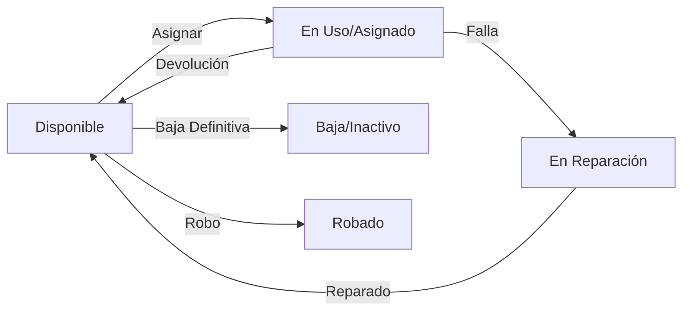
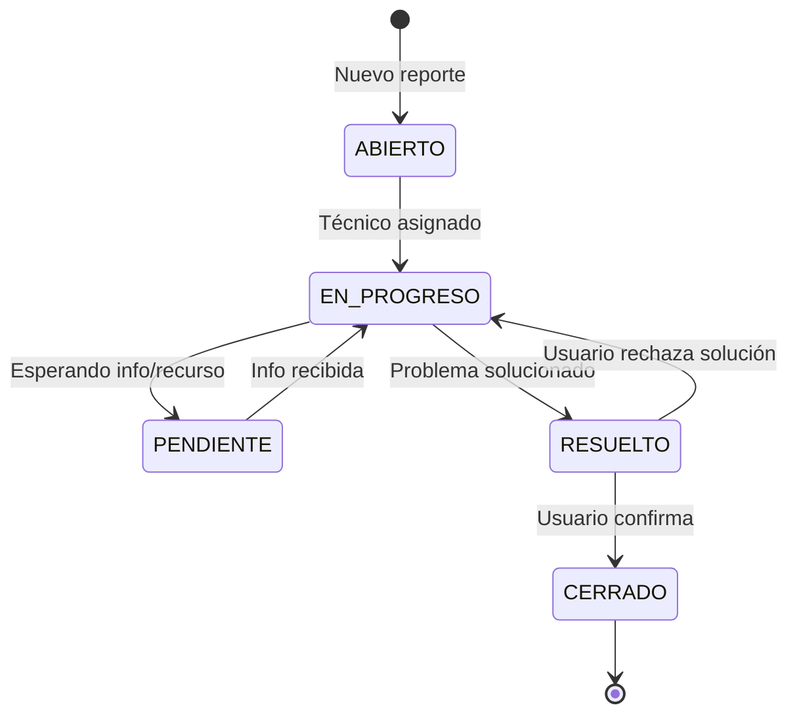
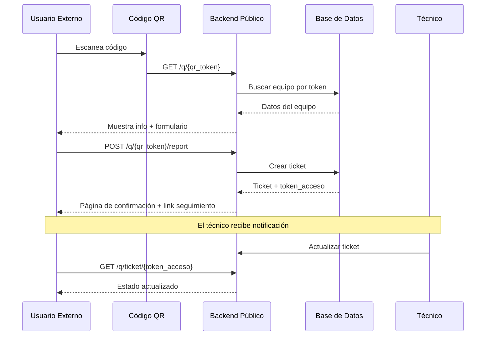

# 🔄 Reglas de Negocio y Flujos Operativos

Este documento describe la lógica de negocio del sistema, crucial para entender cómo interactúan los módulos más allá del código.

---

## 🖥️ 1. Ciclo de Vida de Activos (Equipos)

Un activo tecnológico (Laptop, Impresora, etc.) pasa por diferentes estados controlados por el sistema:

### Diagrama de Estados

### Reglas Críticas
1.  **Unicidad:** Un equipo NO puede tener dos asignaciones activas simultáneas. El sistema bloquea esto validando si existe una asignación con `fecha_fin_asignacion = NULL`.
2.  **Eliminación:** No se pueden eliminar equipos que tengan historial de asignaciones o mantenimientos. Se debe cambiar su estatus a **Baja** (Soft Delete).
3.  **Componentes Hijos:** Algunos equipos (Monitores, Teclados) pueden asignarse a un "Equipo Padre" (ej. PC Desktop) en lugar de a un empleado directamente.

---

## 📋 2. Reglas de Asignaciones

El módulo de Asignaciones es el núcleo transaccional.

1.  **Tipos de Asignación:**
    *   **A Empleado:** El equipo es responsabilidad de una persona.
    *   **A Sucursal/Área:** Equipos de uso compartido (ej. Impresora de pasillo).
    *   **A Equipo Padre:** Componente parte de otro (ej. Disco Duro externo a Laptop).

2.  **Efectos Colaterales (Triggers Lógicos):**
    *   **Al Crear Asignación:**
        *   Cambia el status del equipo a `Asignado (ID: 4)`.
        *   Si se asigna una IP, cambia el status de la IP a `Ocupada`.
    *   **Al Finalizar Asignación:**
        *   Requiere fecha de fin obligatoria.
        *   Libera el equipo (vuelve a `Disponible`).
        *   Libera la IP asociada.

---

## 🌐 3. Gestión de Red e IPs

Referencia al plan maestro: `docs/PLAN_SEGMENTACION_RED.md`.

*   **Segmentación:** Las IPs están estrictamente divididas por departamento (Supernetting /20).
*   **Validación:** Al crear una IP, el sistema valida que no exista duplicidad en la red (`UNIQUE`).

---

## 🛠️ 4. Mantenimientos

1.  **Registro:** Todo mantenimiento debe asociarse a un equipo existente y (opcionalmente) a una empresa proveedora.
2.  **Impacto:** Un equipo en mantenimiento puede o no estar asignado. Si es una reparación mayor, se recomienda finalizar la asignación temporalmente.
3.  **Evidencias (Fase 2B):** Se pueden adjuntar fotos del estado ANTES, DESPUÉS y DIAGNÓSTICOS del mantenimiento.
4.  **Recálculo Automático:** Al completar un mantenimiento PREVENTIVO, el sistema calcula automáticamente la próxima fecha basándose en `frecuencia_mantenimiento_meses` del equipo.

---

## 🎫 5. Tickets de Soporte (Fase 2)

El módulo Helpdesk permite gestionar incidencias reportadas por usuarios internos y externos.

### Ciclo de Vida de Tickets

### Reglas Críticas

1.  **Token de Acceso:** Cada ticket genera un `token_acceso` único que permite seguimiento público sin login.
2.  **Asignación:** Un ticket puede existir sin técnico asignado (estado inicial). Al asignar técnico, el estado cambia automáticamente a `EN_PROGRESO`.
3.  **Comentarios Internos:** Los comentarios marcados como `es_interno = 1` NO son visibles para usuarios externos.
4.  **Prioridades SLA:**
    *   `CRITICA`: 4 horas
    *   `ALTA`: 8 horas
    *   `MEDIA`: 24 horas
    *   `BAJA`: 72 horas

---

## 📱 6. Flujo de Escaneo QR (Fase 2)

Los equipos pueden tener un código QR único para reportes públicos.

### Flujo Completo

### Reglas de QR

1.  **Generación:** El `qr_token` se genera al crear o editar el equipo. Es único por equipo.
2.  **Acceso Público:** Las rutas `/q/*` NO requieren autenticación JWT.
3.  **Datos Limitados:** Los endpoints públicos solo exponen información no sensible (marca, modelo, tipo, sucursal).
4.  **Evidencia Opcional:** El reportante puede adjuntar una foto del problema.

---

## 🔍 7. Auditoría del Sistema (Fase 2)

El sistema registra automáticamente todas las operaciones de escritura en tablas críticas.

### Operaciones Registradas

| Acción | Descripción | Tablas Auditadas |
|:-------|:------------|:-----------------|
| `CREATE` | Creación de registros | equipos, empleados, asignaciones, tickets, mantenimientos |
| `UPDATE` | Modificación de registros | equipos, empleados, asignaciones, tickets, mantenimientos |
| `DELETE` | Eliminación de registros | Todas las anteriores |

### Información Capturada

*   **Usuario:** ID del usuario que realizó la acción
*   **Valores Anteriores:** JSON con estado previo (para UPDATE/DELETE)
*   **Valores Nuevos:** JSON con datos enviados (para CREATE/UPDATE)
*   **Metadata:** IP de origen, User-Agent, timestamp

### Reglas de Auditoría

1.  **Automatización:** El middleware intercepta automáticamente las rutas configuradas.
2.  **No Bloqueo:** Un fallo en el registro de auditoría NO bloquea la operación principal.
3.  **Inmutabilidad:** Los registros de auditoría no pueden modificarse ni eliminarse desde la aplicación.

---

## 👥 8. Rol SUPERVISOR (Fase 2)

El rol SUPERVISOR es un nivel intermedio entre Soporte y Administrador.

### Características

| Aspecto | SUPERVISOR | ADMIN |
|:--------|:-----------|:------|
| Scope | Solo su sucursal | Todo el sistema |
| Equipos | Ver/Editar de su sucursal | Ver/Editar todo |
| Tickets | Ver/Gestionar de su sucursal | Ver/Gestionar todo |
| Usuarios | Solo lectura | CRUD completo |
| Configuración | Sin acceso | Acceso total |

### Reglas de Filtrado

1.  **Por Sucursal:** El SUPERVISOR solo ve registros donde `id_sucursal` coincide con su asignación.
2.  **Herencia:** Un SUPERVISOR puede ver equipos de empleados asignados a su sucursal.
3.  **Aprobaciones:** Ciertas acciones pueden requerir aprobación del SUPERVISOR antes de ejecutarse.

---

## 🔐 9. Seguridad y Trazabilidad

*   **Inmutabilidad:** Las asignaciones finalizadas no se deben editar, son evidencia histórica.
*   **Trazabilidad:** Cada registro guarda `fecha_registro` y `fecha_actualizacion` automáticamente.
*   **Acceso:** Solo el rol `Admin` y `Soporte` pueden modificar inventario. `Viewer` solo consulta.
*   **Auditoría:** Todas las operaciones críticas quedan registradas en `logs_sistema`.

