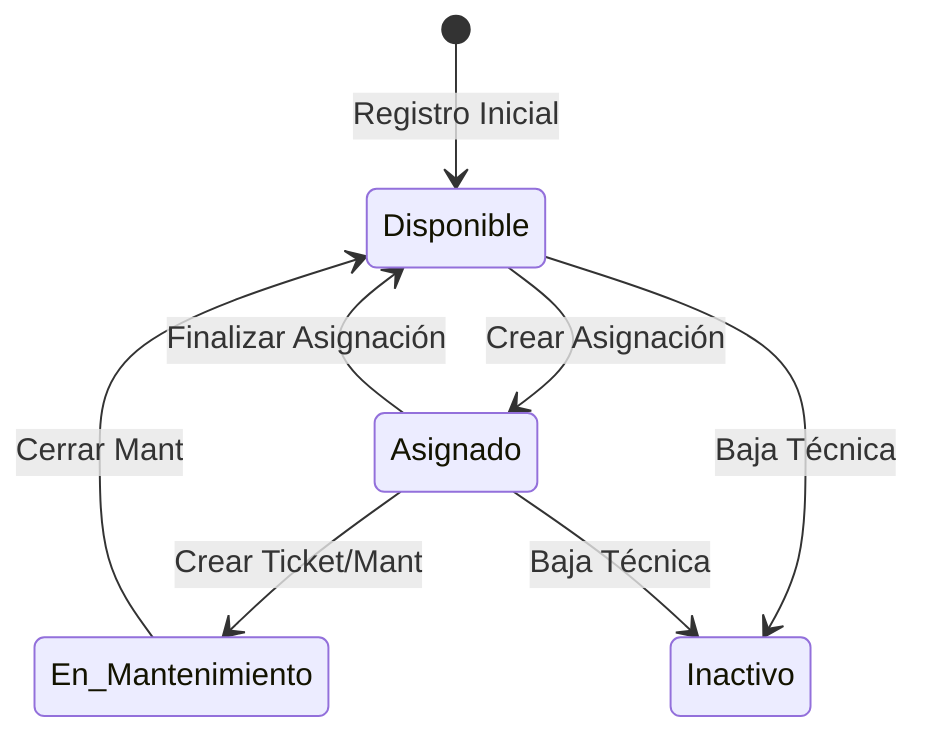

# ⚖️ Reglas de Negocio y Lógica de Estados

> **Gobernanza del Sistema:** Definición de flujos de trabajo, restricciones y validaciones críticas.

---

## 1. 💻 Ciclo de Vida del Activo (Equipos)

Un equipo transiciona entre estados según la interacción del usuario. El sistema impide saltos de estado inválidos.

### Restricciones de Inventario:
- **Unicidad:** No se permiten duplicados de `numero_serie` ni `mac_address` a nivel global.
- **Validación de Baja:** Un equipo no puede darse de baja si tiene un `ticket` en estado `EN_PROGRESO`.

---

## 2. 🔗 Lógica de Asignaciones

Las asignaciones son el vínculo legal entre la empresa y el recurso.

1.  **Validación de Disponibilidad:** Solo equipos en estado `Disponible` pueden ser seleccionados para una nueva asignación.
2.  **Asignación de IP:** Si un equipo es de tipo `Desktop` o `Laptop`, el sistema sugiere una IP disponible dentro del rango de la sucursal seleccionada.
3.  **Histórico:** Al finalizar una asignación, el registro se mueve a "Histórico" (cambio de status a `Finalizada`) y el equipo vuelve a estar `Disponible`.
4.  **Inmutabilidad de Documentos:** Una vez que una asignación es firmada digitalmente, el PDF generado se considera "congelado". Aunque los datos del equipo cambien en el futuro, el documento histórico debe preservar la información que existía al momento de la firma.
5.  **Restricción de Firma:** Solo se permite la firma digital en asignaciones en estado `ACTIVA`. Las asignaciones históricas no pueden ser firmadas retroactivamente.
6.  **Mapeo de Fallas:** Para facilitar la usabilidad por personal no técnico, el sistema traduce opciones amigables (ej. "Lentitud") a categorías técnicas (ej. `SOFTWARE`) de forma automática antes de la persistencia en la base de datos.

---

## 3. 🎫 Soporte y Helpdesk (SLA)

El sistema gestiona prioridades basadas en el impacto operativo.

| Prioridad | Impacto | SLA de Respuesta |
| :--- | :--- | :--- |
| **CRITICA** | Detención total de un área o sucursal. | < 2 Horas |
| **ALTA** | El empleado no puede trabajar. | < 4 Horas |
| **MEDIA** | Trabajo degradado pero funcional. | < 24 Horas |
| **BAJA** | Consulta o mejora menor. | < 72 Horas |

### Gobernanza de Prioridad por Rol:
1. **Usuario Normal (roleId=2):** Puede sugerir `BAJA`, `MEDIA` o `ALTA` al crear su ticket.
2. **Prioridad CRITICA:** Solo puede ser asignada por `Admin`.
3. **Prioridad Operativa Final:** Siempre queda bajo responsabilidad del equipo de soporte.
4. **Auditoría:** Todo cambio de prioridad genera mensaje automático de sistema en el chat del ticket.

### Gobernanza de Operación por Rol:
1. **Admin (roleId=1):** Puede asignar responsable (analista o admin), cambiar prioridad, cambiar estatus y eliminar tickets.
2. **Analista (roleId=3):** Solo puede cambiar estatus y comentar en tickets asignados a su usuario.
3. **Usuario Normal (roleId=2):** Solo puede crear/consultar/comentar sus tickets.

### Responsable Operativo:
1. Si un ticket tiene responsable asignado (`id_asignado_a`), la atención operativa recae en ese usuario.
2. Si no tiene responsable, el ticket permanece en triage de administración.

### Trazabilidad Automática (Chat Audit):
Cualquier cambio administrativo en un ticket (Estatus, Prioridad o Técnico asignado) genera automáticamente un mensaje de sistema en el hilo de conversación. Esto asegura que el reportante esté informado en tiempo real de los avances sin necesidad de interacción manual del técnico.

### Máquina de Estados de Ticket:
Estados permitidos: `ABIERTO`, `EN_PROGRESO`, `PENDIENTE`, `RESUELTO`, `CERRADO`.

Reglas activas:
1. Se validan transiciones permitidas por backend.
2. Al pasar a `RESUELTO` o `CERRADO` se registra `fecha_cierre`.
3. Si un ticket se reabre desde un estado final, `fecha_cierre` se limpia para mantener consistencia histórica.

### Política de Cierre de Comunicación:
Para garantizar que los registros de soporte no se alteren después de haber sido solucionados:
1. **Bloqueo por Estatus:** Al transicionar a `RESUELTO` o `CERRADO`, el canal de comunicación se cierra de forma bidireccional.
2. **Reapertura controlada:** El usuario final no puede comentar en tickets finalizados. La reapertura operativa solo ocurre por actualización de estatus desde soporte.
3. **Banner Informativo:** El portal público muestra un aviso explícito de "Reporte Finalizado" al detectar estos estados.

### Notificaciones de Soporte:
1. **Nuevo ticket:** se notifica al canal admin (alerta + admins con correo).
2. **Confirmación de creación:** se notifica al solicitante cuando hay correo asociado.
3. **Asignación:** se notifica al responsable asignado.
4. **Comentario de soporte:** se notifica al solicitante.
5. **Comentario del solicitante:** se notifica al responsable asignado; si no existe, al canal admin.
6. **Cambio de estatus:** se notifica al solicitante.

### Política de Canal (Web vs Email):
1. **Web (badge no leídos):** canal primario para actividad frecuente de conversación.
2. **Email:** canal transaccional para hitos operativos (creación, asignación, estatus, reapertura).
3. **Anti-saturación:** evitar envío por cada mensaje cuando existe alta frecuencia de interacción.

---

## 4. 🔐 Seguridad y Auditoría

- **Sesión:** Los tokens JWT expiran en 30 días (configurable en `.env`).
- **Trazabilidad:** Cualquier cambio en la tabla `equipos`, `empleados` o `asignaciones` debe generar un registro automático en `logs_sistema`.
- **Integridad:** Las eliminaciones físicas (`Hard Delete`) están prohibidas para registros con relaciones existentes (Integridad Referencial).

---

## 🌐 Segmentación de Red (Lógica)

El sistema valida que las IPs asignadas correspondan a la red de la sucursal:
- **Matriz:** Segmento `10.10.X.X`
- **Sucursales:** Segmento `10.20.X.X`
- **Público (Invitados):** Segmento `172.16.X.X`