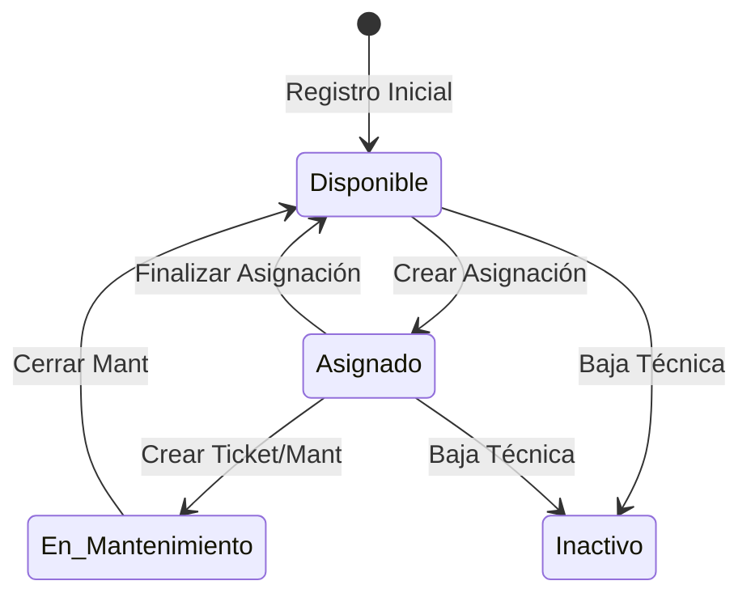

# ⚖️ Reglas de Negocio y Lógica de Estados

> **Gobernanza del Sistema:** Definición de flujos de trabajo, restricciones y validaciones críticas.

---

## 1. 💻 Ciclo de Vida del Activo (Equipos)

Un equipo transiciona entre estados según la interacción del usuario. El sistema impide saltos de estado inválidos.

### Restricciones de Inventario:
- **Unicidad:** No se permiten duplicados de `numero_serie` ni `mac_address` a nivel global.
- **Validación de Baja:** Un equipo no puede darse de baja si tiene un `ticket` en estado `EN_PROGRESO`.

---

## 2. 🔗 Lógica de Asignaciones

Las asignaciones son el vínculo legal entre la empresa y el recurso.

1.  **Validación de Disponibilidad:** Solo equipos en estado `Disponible` pueden ser seleccionados para una nueva asignación.
2.  **Asignación de IP:** Si un equipo es de tipo `Desktop` o `Laptop`, el sistema sugiere una IP disponible dentro del rango de la sucursal seleccionada.
3.  **Histórico:** Al finalizar una asignación, el registro se mueve a "Histórico" (cambio de status a `Finalizada`) y el equipo vuelve a estar `Disponible`.
4.  **Inmutabilidad de Documentos:** Una vez que una asignación es firmada digitalmente, el PDF generado se considera "congelado". Aunque los datos del equipo cambien en el futuro, el documento histórico debe preservar la información que existía al momento de la firma.
5.  **Restricción de Firma:** Solo se permite la firma digital en asignaciones en estado `ACTIVA`. Las asignaciones históricas no pueden ser firmadas retroactivamente.
6.  **Mapeo de Fallas:** Para facilitar la usabilidad por personal no técnico, el sistema traduce opciones amigables (ej. "Lentitud") a categorías técnicas (ej. `SOFTWARE`) de forma automática antes de la persistencia en la base de datos.

---

## 3. 🎫 Soporte y Helpdesk (SLA)

El sistema gestiona prioridades basadas en el impacto operativo.

| Prioridad | Impacto | SLA de Respuesta |
| :--- | :--- | :--- |
| **CRITICA** | Detención total de un área o sucursal. | < 2 Horas |
| **ALTA** | El empleado no puede trabajar. | < 4 Horas |
| **MEDIA** | Trabajo degradado pero funcional. | < 24 Horas |
| **BAJA** | Consulta o mejora menor. | < 72 Horas |

---

## 4. 🔐 Seguridad y Auditoría

- **Sesión:** Los tokens JWT expiran en 30 días (configurable en `.env`).
- **Trazabilidad:** Cualquier cambio en la tabla `equipos`, `empleados` o `asignaciones` debe generar un registro automático en `logs_sistema`.
- **Integridad:** Las eliminaciones físicas (`Hard Delete`) están prohibidas para registros con relaciones existentes (Integridad Referencial).

---

## 🌐 Segmentación de Red (Lógica)

El sistema valida que las IPs asignadas correspondan a la red de la sucursal:
- **Matriz:** Segmento `10.10.X.X`
- **Sucursales:** Segmento `10.20.X.X`
- **Público (Invitados):** Segmento `172.16.X.X`