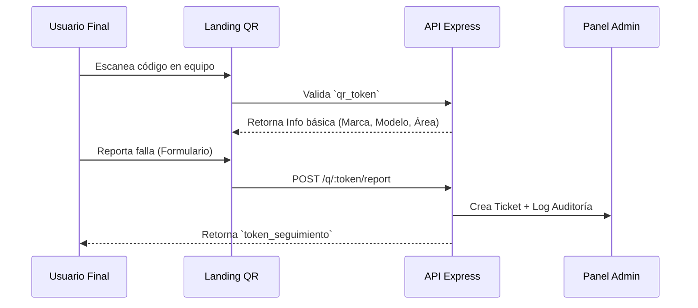

# 🚀 Evolución: Fase 2 (Helpdesk & Soporte)

> **Hitos de Escalabilidad:** Implementación de soporte público, auditoría y automatización.

---

## 📱 Flujo de Soporte QR (Public Access)

El sistema permite la interacción de usuarios sin cuenta mediante tokens de acceso único.

---

## 👮 Sistema de Auditoría (Logs)

Se implementó una capa de interceptación de datos para garantizar la transparencia operativa.

### Características del Log:
*   **Snapshots JSON:** Almacena el estado completo del registro antes y después del cambio.
*   **Identificación de Origen:** Registra la IP y el User-Agent para identificar desde qué dispositivo se realizó la acción.
*   **Inmutabilidad:** Los logs son registros de solo inserción; no existe endpoint para editarlos o borrarlos.

---

## 🔧 Tareas Programadas (Cron Jobs)

El sistema automatiza tareas de mantenimiento preventivo:
1.  **Cálculo de Próximo Mantenimiento:** Cada 24h, el sistema revisa la fecha del último mantenimiento y proyecta la siguiente según la frecuencia del equipo.
2.  **Alertas de Vencimiento:** Notifica al dashboard sobre equipos que superaron su fecha de mantenimiento programada.
3.  **Limpieza de Tokens:** Invalida tokens de restablecimiento de contraseña expirados.

---

## 📧 Integración de Notificaciones
*   **Backend:** Uso de `Nodemailer` configurado para SMTP empresarial.
*   **Eventos:**
    *   Nuevo ticket creado.
    *   Cambio de estatus de ticket (Notifica al usuario reportante).
    *   Asignación de ticket a un técnico.
