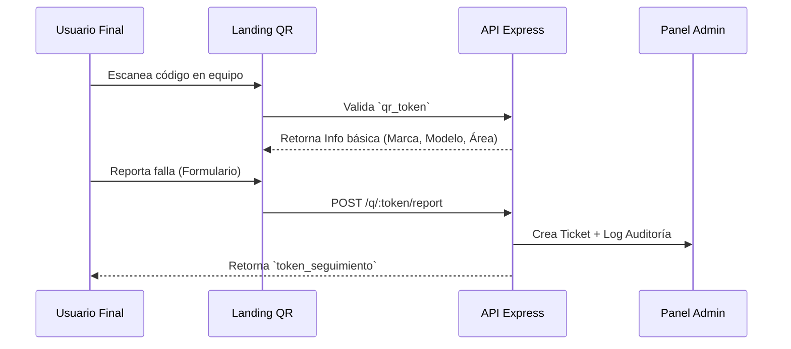

# 🚀 Evolución: Fase 2 (Helpdesk & Soporte)

> **Hitos de Escalabilidad:** Implementación de soporte público, auditoría y automatización.

---

## 📱 Flujo de Soporte QR (Public Access)

El sistema permite la interacción de usuarios sin cuenta mediante tokens de acceso único.

---

## 👮 Sistema de Auditoría (Logs)

Se implementó una capa de interceptación de datos para garantizar la transparencia operativa.

### Características del Log:
*   **Snapshots JSON:** Almacena el estado completo del registro antes y después del cambio.
*   **Identificación de Origen:** Registra la IP y el User-Agent para identificar desde qué dispositivo se realizó la acción.
*   **Inmutabilidad:** Los logs son registros de solo inserción; no existe endpoint para editarlos o borrarlos.

---

## 🔧 Tareas Programadas (Cron Jobs)

El sistema automatiza alertas de mantenimiento:
1.  **Alertas de Próximos 7 Días (Cron Diario):** Cada día a las 08:00 (America/Mexico_City), se consultan:
    - Equipos con `proxima_fecha_mantenimiento` dentro de los próximos 7 días.
    - Mantenimientos manuales en estatus `PENDIENTE` con `fecha_programada` dentro de los próximos 7 días.
2.  **Canal de Notificación Actual:** Las alertas se envían por correo al `ALERT_EMAIL` (o `EMAIL_FROM` como fallback).

### 📅 Cálculo de Fechas de Mantenimiento (Regla Operativa)

El cálculo de la próxima fecha preventiva **no** se ejecuta por cron cada 24h. Se calcula en el flujo de negocio cuando:

1. Un mantenimiento de tipo `PREVENTIVO` cambia a estatus `COMPLETADO`.
2. Se registra `ultima_fecha_mantenimiento` con la fecha de cierre (`fecha_realizada` o fecha actual).
3. Si el equipo tiene `frecuencia_mantenimiento_meses`, se calcula:
   `proxima_fecha_mantenimiento = fecha_cierre + frecuencia_mantenimiento_meses`.

Si el equipo no tiene frecuencia definida, solo se actualiza `ultima_fecha_mantenimiento`.

---

## 📧 Integración de Notificaciones
*   **Backend:** Uso de `Nodemailer` configurado para SMTP empresarial.
*   **Eventos:**
    *   Nuevo ticket creado.
    *   Cambio de estatus de ticket (Notifica al usuario reportante).
    *   Asignación de ticket a un técnico.
