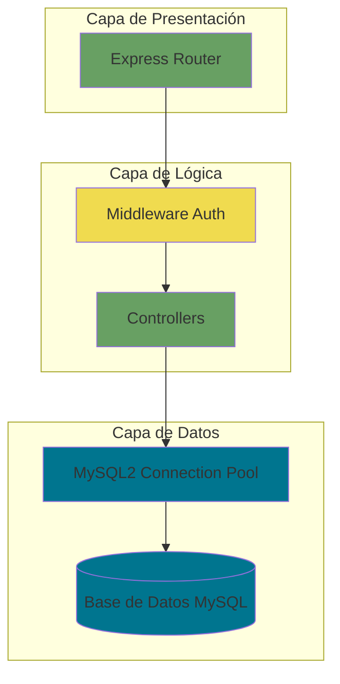
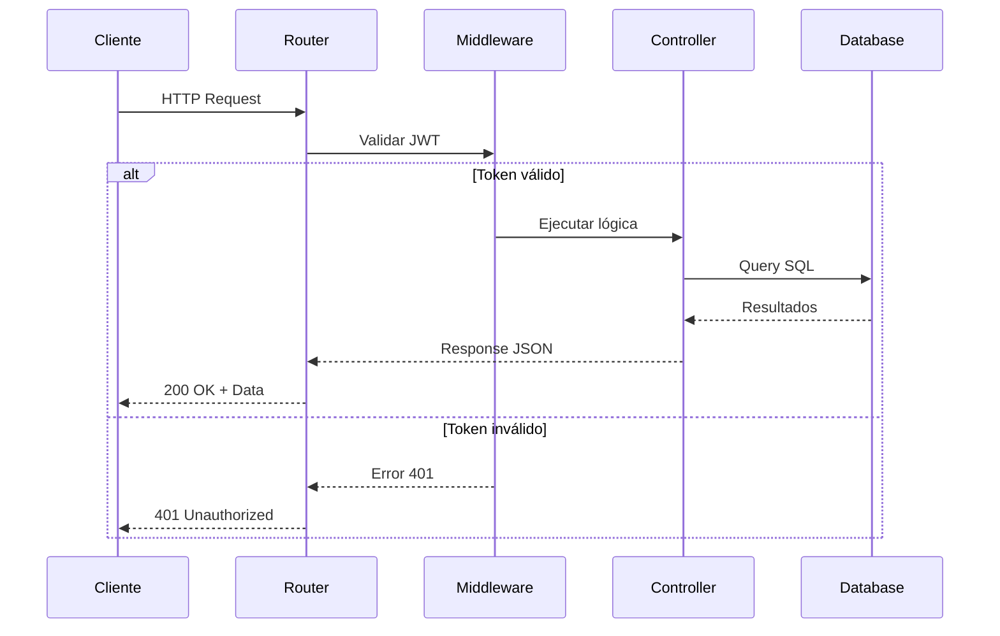
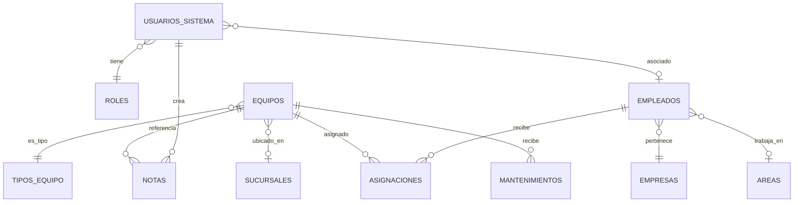

# 🔧 Backend - Inventario TI & Soporte LDS

> API RESTful construida con Express.js y MySQL para la gestión integral de inventario tecnológico.

---

## 📋 Tabla de Contenidos

- [Arquitectura](#-arquitectura)
- [Instalación](#-instalación)
- [Configuración](#-configuración)
- [Estructura del Proyecto](#-estructura-del-proyecto)
- [API Endpoints](#-api-endpoints)
- [Base de Datos](#-base-de-datos)
- [Seguridad](#-seguridad)
- [Despliegue](#-despliegue)

---

## 🏗️ Arquitectura



### Flujo de una Petición



---

## 🚀 Instalación

### Requisitos

- Node.js v18 o superior
- MySQL Server 8.0 o superior
- NPM o Yarn

### Pasos

1. **Navegar al directorio del servidor:**
   ```bash
   cd server
   ```

2. **Instalar dependencias:**
   ```bash
   npm install
   ```

3. **Configurar variables de entorno:**
   ```bash
   cp .env.example .env
   ```

4. **Iniciar el servidor:**
   ```bash
   # Desarrollo (con nodemon)
   npm run dev
   
   # Producción
   npm start
   ```

---

## ⚙️ Configuración

### Variables de Entorno (.env)

```env
# Servidor
PORT=3000
NODE_ENV=development

# Base de Datos
DB_HOST=localhost
DB_USER=root
DB_PASSWORD=tu_password
DB_NAME=inventario_soporte
DB_PORT=3306

# Seguridad
JWT_SECRET=tu_secreto_super_seguro_aqui
JWT_EXPIRE=30d

# Correo SMTP (Recuperación de contraseña)
EMAIL_HOST=mail.tuserver.com
EMAIL_PORT=587
EMAIL_USER=tu_usuario
EMAIL_PASS=tu_password
EMAIL_FROM=no-reply@tudominio.com

# Frontend URL (Para generar enlaces)
FRONTEND_URL=http://localhost:5173
```

### Generar JWT_SECRET Seguro

```bash
node -e "console.log(require('crypto').randomBytes(64).toString('hex'))"
```

---

## 📁 Estructura del Proyecto

```
server/
├── src/
│   ├── config/
│   │   └── db.js                 # Configuración de MySQL
│   │
│   ├── controllers/              # Lógica de negocio
│   │   ├── auth.controller.js
│   │   ├── profile.controller.js
│   │   ├── equipos.controller.js
│   │   ├── empleados.controller.js
│   │   ├── asignaciones.controller.js
│   │   ├── mantenimientos.controller.js
│   │   ├── notas.controller.js
│   │   ├── direcciones_ip.controller.js
│   │   ├── cuentas_email.controller.js
│   │   ├── empresas.controller.js
│   │   ├── areas.controller.js
│   │   ├── sucursales.controller.js
│   │   ├── roles.controller.js
│   │   ├── status.controller.js
│   │   ├── tipos_equipo.controller.js
│   │   ├── tipos_sucursal.controller.js
│   │   └── usuarios_sistema.controller.js
│   │
│   ├── middleware/
│   │   └── auth.middleware.js    # Validación JWT
│   │
│   └── routes/                   # Definición de rutas
│       ├── auth.routes.js
│       ├── profile.routes.js
│       ├── equipos.routes.js
│       ├── empleados.routes.js
│       ├── asignaciones.routes.js
│       ├── mantenimientos.routes.js
│       ├── notas.routes.js
│       ├── direcciones_ip.routes.js
│       ├── cuentas_email.routes.js
│       ├── empresas.routes.js
│       ├── areas.routes.js
│       ├── sucursales.routes.js
│       ├── roles.routes.js
│       ├── status.routes.js
│       ├── tipos_equipo.routes.js
│       ├── tipos_sucursal.routes.js
│       └── usuarios_sistema.routes.js
│
├── public/                       # Archivos estáticos
├── .env.example
├── .gitignore
├── package.json
├── README.md
└── server.js                     # Punto de entrada
```

---

## 🌐 API Endpoints

### Autenticación (Públicas)

| Método | Endpoint | Descripción | Body |
|:-------|:---------|:------------|:-----|
| POST | `/api/auth/login` | Iniciar sesión | `{ username, password }` |
| POST | `/api/auth/forgot-password` | Solicitar recuperación | `{ email }` |
| POST | `/api/auth/reset-password` | Restablecer con token | `{ token, newPassword }` |

**Respuesta exitosa:**
```json
{
  "message": "Inicio de sesión exitoso.",
  "token": "eyJhbGciOiJIUzI1NiIsInR5cCI6IkpXVCJ9...",
  "user": {
    "id": 1,
    "username": "admin",
    "roleId": 1,
    "roleName": "Administrador"
  }
}
```

### Perfil de Usuario (Protegidas)

| Método | Endpoint | Descripción | Body |
|:-------|:---------|:------------|:-----|
| GET | `/api/profile` | Obtener perfil del usuario autenticado | - |
| PUT | `/api/profile` | Actualizar email y/o contraseña | `{ email?, currentPassword?, newPassword? }` |

### Módulos CRUD (Protegidas)

Todos los módulos siguen el patrón REST estándar:

| Método | Endpoint | Descripción |
|:-------|:---------|:------------|
| GET | `/api/{modulo}` | Listar todos |
| GET | `/api/{modulo}/:id` | Obtener por ID |
| POST | `/api/{modulo}` | Crear nuevo |
| PUT | `/api/{modulo}/:id` | Actualizar |
| DELETE | `/api/{modulo}/:id` | Eliminar |

**Módulos disponibles:**
- `equipos`
- `empleados`
- `asignaciones`
- `mantenimientos`
- `notas`
- `direcciones-ip`
- `cuentas-email`
- `empresas`
- `areas`
- `sucursales`
- `usuarios-sistema`

### Catálogos (Protegidas)

| Método | Endpoint | Descripción |
|:-------|:---------|:------------|
| GET | `/api/roles` | Listar roles |
| GET | `/api/status` | Listar estados |
| GET | `/api/tipos-equipo` | Listar tipos de equipo |
| GET | `/api/tipos-sucursal` | Listar tipos de sucursal |

---

## 🗄️ Base de Datos

### Configuración de Conexión

El sistema utiliza **MySQL2** con connection pooling para optimizar el rendimiento:

```javascript
// src/config/db.js
const mysql = require('mysql2/promise');

const pool = mysql.createPool({
    host: process.env.DB_HOST,
    user: process.env.DB_USER,
    password: process.env.DB_PASSWORD,
    database: process.env.DB_NAME,
    port: process.env.DB_PORT || 3306,
    waitForConnections: true,
    connectionLimit: 10,
    queueLimit: 0
});
```

### Tablas Principales



### Backup y Restauración

**Crear backup:**
```bash
mysqldump -h localhost -u root -p inventario_soporte > backup_$(date +%Y%m%d).sql
```

**Restaurar backup:**
```bash
mysql -h localhost -u root -p inventario_soporte < backup.sql
```

---

## 🔒 Seguridad

### Autenticación JWT

El sistema utiliza JSON Web Tokens para autenticación stateless:

1. **Login:** El usuario envía credenciales
2. **Verificación:** Se valida contra la base de datos
3. **Generación:** Se crea un JWT con payload:
   ```javascript
   {
     userId: 1,
     username: "admin",
     roleId: 1
   }
   ```
4. **Respuesta:** Se envía el token al cliente
5. **Uso:** El cliente incluye el token en cada petición:
   ```
   Authorization: Bearer {token}
   ```

### Middleware de Protección

```javascript
// src/middleware/auth.middleware.js
const protect = (req, res, next) => {
    const token = req.headers.authorization?.split(' ')[1];
    
    if (!token) {
        return res.status(401).json({ message: 'No autorizado' });
    }
    
    try {
        const decoded = jwt.verify(token, process.env.JWT_SECRET);
        req.user = decoded;
        next();
    } catch (error) {
        return res.status(401).json({ message: 'Token inválido' });
    }
};
```

### Hash de Contraseñas

Las contraseñas se hashean con **bcrypt** (10 rounds):

```javascript
const bcrypt = require('bcrypt');
const saltRounds = 10;

// Al crear usuario
const passwordHash = await bcrypt.hash(password, saltRounds);

// Al verificar login
const isValid = await bcrypt.compare(password, storedHash);
```

### Prevención de SQL Injection

Se utilizan **prepared statements** de MySQL2:

```javascript
// ✅ Correcto
const sql = 'SELECT * FROM equipos WHERE id = ?';
const [rows] = await query(sql, [id]);

// ❌ Incorrecto (vulnerable)
const sql = `SELECT * FROM equipos WHERE id = ${id}`;
```

---

## 🚀 Despliegue

### Opción 1: PM2 (Recomendado)

```bash
# Instalar PM2 globalmente
npm install -g pm2

# Iniciar aplicación
pm2 start server.js --name "inventario-api"

# Guardar configuración
pm2 save
pm2 startup
```

### Opción 2: Systemd Service

Crear archivo `/etc/systemd/system/inventario-api.service`:

```ini
[Unit]
Description=Inventario API
After=network.target

[Service]
Type=simple
User=www-data
WorkingDirectory=/var/www/inventario-ti-lds/server
ExecStart=/usr/bin/node server.js
Restart=on-failure

[Install]
WantedBy=multi-user.target
```

Activar servicio:
```bash
sudo systemctl enable inventario-api
sudo systemctl start inventario-api
```

### Nginx Reverse Proxy

```nginx
server {
    listen 80;
    server_name api.tudominio.com;

    location /api {
        proxy_pass http://localhost:3000;
        proxy_http_version 1.1;
        proxy_set_header Upgrade $http_upgrade;
        proxy_set_header Connection 'upgrade';
        proxy_set_header Host $host;
        proxy_set_header X-Real-IP $remote_addr;
        proxy_cache_bypass $http_upgrade;
    }
}
```

---

## 🛠️ Comandos Útiles

```bash
# Desarrollo
npm run dev          # Iniciar con nodemon

# Producción
npm start            # Iniciar servidor

# Logs (con PM2)
pm2 logs inventario-api

# Reiniciar (con PM2)
pm2 restart inventario-api

# Monitoreo (con PM2)
pm2 monit
```

---

## 📊 Monitoreo y Logs

### Logs de Aplicación

Los logs se muestran en consola con formato:

```
🚀 Servidor corriendo en: http://localhost:3000
🔧 Modo: development
✅ Base de datos conectada exitosamente.
```

### Errores

Los errores se capturan con el middleware global:

```javascript
app.use((err, req, res, next) => {
    console.error('-------- ERROR --------');
    console.error(err.stack);
    console.error('-----------------------');
    
    res.status(err.status || 500).json({
        message: err.message || 'Error interno del servidor',
        error: process.env.NODE_ENV === 'development' ? err.stack : {}
    });
});
```

---

## 🤝 Contribuir

Ver [README principal](../README.md#-contribuir) para guías de contribución.

### Estándar de Documentación
Este proyecto utiliza **JSDoc** para documentar la API y la lógica de negocio:
- Módulos: `@module` y `@description`
- Controladores: Descripción de inputs/outputs
- Middleware: Explicación de lógica de seguridad


---

## 📄 Licencia

ISC License - Ver [LICENSE](../LICENSE) para más detalles.
